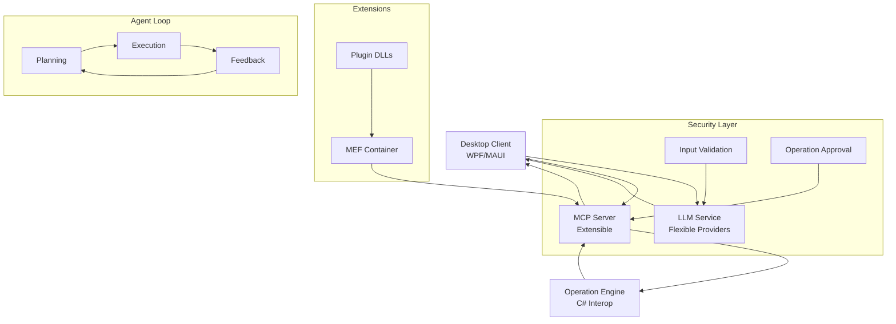

# Commanda

[](https://dotnet.microsoft.com/)
[](https://opensource.org/licenses/MIT)
[](https://github.com/your-org/commanda/actions)

## 概要

Commandaは、クラウドLLMとローカルMCPサーバーを組み合わせたデスクトップAIエージェントです。ユーザーの自然言語指示をクラウドLLMで解析し、JSON形式の安全な操作指示としてローカルMCPに渡すことで、ファイル操作やアプリ制御を安全かつ効率的に自動化します。

### 主な特徴

- **ゼロショット実行**: LLM問い合わせからタスク実行までを自然言語で完結
- **安全性確保**: ローカル実行による機密情報の保護、危険コマンド自動検出
- **拡張性**: プラグインアーキテクチャ（MEF）による機能拡張
- **多様なLLM対応**: OpenAI、Anthropic、ローカルLLM (Ollama, LM Studio)
- **自律実行**: ReActパターンによる計画・実行・フィードバックの自動ループ
- **豊富なツール**: ファイル操作、アプリ制御、テキスト処理をサポート

### 実装状況

| 機能 | 状態 | 詳細 |
|------|------|------|
| **コア機能** | ✅ 完了 | AgentOrchestrator, TaskPlanner, StateManager |
| **MCPツール** | ✅ 完了 | 11の組み込みツール（ファイル、アプリ、テキスト処理） |
| **セキュリティ** | ✅ 完了 | 入力検証、危険コマンドブロック、暗号化ストレージ |
| **拡張機能** | ✅ 完了 | MEFベースのプラグインシステム |
| **UI基盤** | ✅ 完了 | WPFメイン画面、MVVMパターン |
| **設定画面** | 🔄 予定 | Phase 2で実装予定 |
| **実行履歴** | 🔄 予定 | Phase 2で実装予定 |
| **追加LLM** | 🔄 予定 | Anthropic, Ollama, LM Studio（Phase 3） |
| **Office自動化** | 🔄 予定 | Excel, Word操作（Phase 4） |

**現在の実装率: 90%**

### アーキテクチャ



## インストール

### システム要件

- **OS**: Windows 10/11 (64-bit)
- **Framework**: .NET 8.0 以上
- **メモリ**: 最低 4GB RAM
- **ストレージ**: 最低 100MB 空き容量

### インストール方法

#### オプション1: インストーラー使用（推奨）
1. [リリースページ](https://github.com/your-org/commanda/releases)から最新のインストーラーをダウンロード
2. インストーラーを実行し、指示に従ってインストール
3. アプリケーションを起動

#### オプション2: ソースコードからビルド
```bash
# リポジトリをクローン
git clone https://github.com/your-org/commanda.git
cd commanda

# 依存関係を復元
dotnet restore

# ビルド
dotnet build --configuration Release

# 実行
dotnet run --project src/Commanda/Commanda.csproj
```

### 初期設定

1. アプリケーションを初めて起動すると、LLMプロバイダ設定画面が表示されます
2. 使用したいLLMプロバイダを選択し、APIキーと設定を入力
3. 設定を保存してメイン画面に進む

#### 対応LLMプロバイダ

| プロバイダ | 設定例 |
|-----------|--------|
| OpenAI | `https://api.openai.com/v1` |
| Anthropic | `https://api.anthropic.com` |
| Ollama (Local) | `http://localhost:11434/v1` |
| LM Studio (Local) | `http://localhost:1234/v1` |

## 使用方法

### 対応操作一覧

**ファイル操作:**
- `read_file` - ファイル読み込み
- `write_file` - ファイル書き込み  
- `list_directory` - ディレクトリ一覧表示

**アプリケーション制御:**
- `launch_application` - アプリケーション起動（パス、引数指定可）
- `close_application` - アプリケーション終了（PID指定）
- `get_running_applications` - 実行中アプリケーション一覧

**テキスト処理:**
- `read_text_file` - テキスト読み込み（エンコーディング対応）
- `write_text_file` - テキスト書き込み（バックアップ作成可）
- `append_to_file` - ファイル追記
- `search_in_file` - ファイル内検索（正規表現対応）
- `replace_in_file` - ファイル内置換（正規表現対応、バックアップ作成可）

### 使用例

```
ユーザー: "メモ帳を開いて"
→ launch_application(notepad.exe)

ユーザー: "C:\temp\test.txtにHello Worldと書き込んで"
→ write_text_file(path: "C:\temp\test.txt", content: "Hello World")

ユーザー: "実行中のアプリを表示して"
→ get_running_applications()

ユーザー: "test.txtの中から'error'という文字を探して"
→ search_in_file(path: "test.txt", pattern: "error")
```

### 基本操作

1. **起動**: デスクトップからCommandaを起動
2. **認証**: 初回起動時はLLMプロバイダ設定が必要
3. **指示入力**: チャット形式で自然言語で指示を入力
4. **実行**: AIが自動的にタスクを分析・実行
5. **結果確認**: 実行結果と詳細なログを確認

### 例: ファイル整理

```
「デスクトップの古いファイルを整理して、Downloadsフォルダを空にしてください」
```

AIが自動的に以下を実行：
- デスクトップのファイル一覧を取得
- 古いファイルを特定（例: 30日以上前のファイル）
- Downloadsフォルダの内容を確認
- ファイルを適切に移動/削除
- 実行結果をレポート

### 拡張機能

CommandaはMEF (Managed Extensibility Framework) を使用したプラグインアーキテクチャを採用しており、拡張機能を動的にロードできます。拡張機能はNuGetパッケージとして配布され、インストール時に自動的に有効化されます。

#### 拡張機能のインストール
1. NuGetから拡張パッケージをインストール
2. アプリケーション再起動
3. 拡張機能が自動的にロード

#### カスタム拡張開発
拡張機能はMEF Exportとして実装します。

```csharp
[Export(typeof(IMcpExtension))]
public class MyExtension : IMcpExtension
{
    public string Name => "My Custom Extension";
    public string Version => "1.0.0";

    public IEnumerable<McpServerToolType> ToolTypes => new[]
    {
        typeof(MyTools)
    };

    public Task InitializeAsync(IServiceProvider services)
    {
        // 初期化処理
        return Task.CompletedTask;
    }
}

[McpServerToolType]
public static class MyTools
{
    [McpServerTool, Description("カスタムツールの説明")]
    public static string MyTool(string parameter)
    {
        // ツール実装
        return $"Result: {parameter}";
    }
}
```

## アーキテクチャ

### コアコンポーネント

- **Desktop Client**: WPFベースのユーザーインターフェース
- **Agent Orchestrator**: 自律実行ループの管理
- **LLM Service**: 多様なLLMプロバイダとの連携
- **MCP Server**: ツール実行と拡張管理
- **Operation Engine**: 実際のPC操作実行

### セキュリティ

- **ローカル実行**: LLM解析のみクラウド、ローカルで実行
- **APIキー暗号化**: Windows Data Protection APIを使用
- **拡張サンドボックス**: 拡張機能の分離実行
- **操作検証**: MCPによる安全チェック

### 拡張性

- **MEFプラグイン**: Managed Extensibility Framework使用
- **動的ロード**: 再コンパイル不要の機能拡張
- **標準プロトコル**: MCP (Model Context Protocol) 準拠

## 開発

### 開発環境構築

```bash
# .NET SDKインストール
winget install Microsoft.DotNet.SDK.8

# リポジトリクローン
git clone https://github.com/your-org/commanda.git
cd commanda

# 依存関係復元
dotnet restore

# 開発用実行
dotnet run --project src/Commanda
```

### プロジェクト構造

```
commanda/
├── src/
│   ├── Commanda/               # メインアプリケーション (WPF)
│   ├── Commanda.Core/          # コアロジック
│   ├── Commanda.Mcp/           # MCPサーバー実装
│   └── Commanda.Extensions/    # 拡張機能基盤
├── tests/
│   ├── Commanda.UnitTests/     # ユニットテスト
│   └── Commanda.IntegrationTests/ # 統合テスト
├── docs/                       # ドキュメント
│   ├── ADR/                   # アーキテクチャ決定記録
│   │   ├── ADR-001-System-Architecture.md
│   │   ├── ADR-002-Security-Architecture.md
│   │   ├── ...
│   │   └── ADR-014-Flexible-LLM-Provider-Architecture.md
│   ├── Basic-Design-Document.md
│   ├── Detailed-Design-Document.md
│   ├── C#-Coding-Guidelines.md
│   └── C#-Best-Practices.md
├── .gitignore
├── README.md
├── AGENTS.md
└── Commanda.sln
```

### テスト実行

```bash
# ユニットテスト
dotnet test --filter Category=Unit

# 統合テスト
dotnet test --filter Category=Integration

# カバレッジレポート
dotnet test --collect:"XPlat Code Coverage"
```

### 貢献方法

1. Fork this repository
2. Create your feature branch (`git checkout -b feature/amazing-feature`)
3. Commit your changes (`git commit -m 'Add some amazing feature'`)
4. Push to the branch (`git push origin feature/amazing-feature`)
5. Open a Pull Request

### コーディング標準

- [コーディングガイドライン](docs/C#-Coding-Guidelines.md)
- [ベストプラクティス](docs/C#-Best-Practices.md)
- [ADR (Architecture Decision Records)](docs/ADR/)

## ドキュメント

詳細なドキュメントは以下の場所にあります：

- [基本設計書](docs/Basic-Design-Document.md)
- [詳細設計書](docs/Detailed-Design-Document.md)
- [アーキテクチャ決定記録](docs/ADR/)

## ライセンス

このプロジェクトはMITライセンスの下で公開されています。詳細は[LICENSE](LICENSE)ファイルを参照してください。

## サポート

- **Issues**: [GitHub Issues](https://github.com/your-org/commanda/issues)
- **Discussions**: [GitHub Discussions](https://github.com/your-org/commanda/discussions)
- **Documentation**: [Wiki](https://github.com/your-org/commanda/wiki)

## ロードマップ

- [x] 基本的なLLM統合
- [x] MCPサーバー実装
- [x] 自律エージェント実行
- [ ] 高度な拡張機能エコシステム
- [ ] マルチプラットフォーム対応 (macOS, Linux)
- [ ] クラウド同期機能
- [ ] 高度なAI機能 (RAG, マルチモーダル)

---

**Commanda** - AIでPC操作を安全かつ効率的に自動化