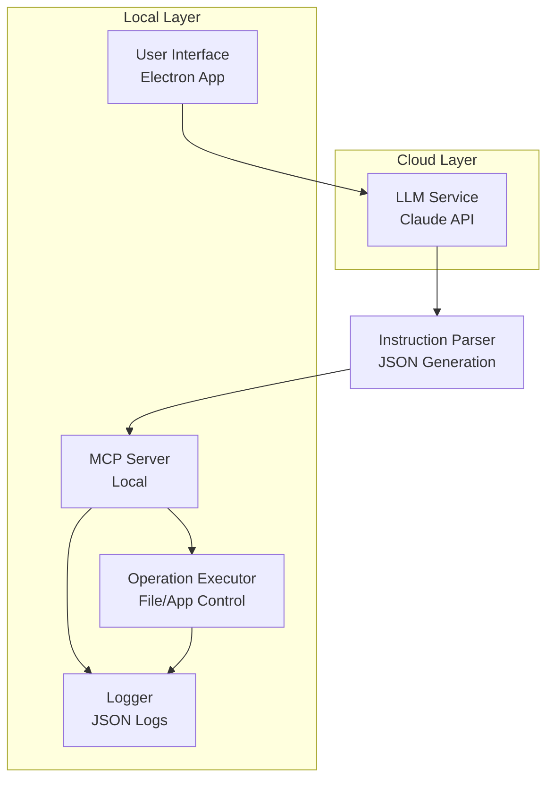

# ADR-001: Commanda システムアーキテクチャ

## ステータス
承認済み

## 背景
CommandaはクラウドLLMとローカルMCPサーバーを組み合わせたデスクトップAIエージェントです。自然言語指示をクラウドLLMで解析し、ローカルMCPで安全に実行することで、ログによる再現性を確保します。

## 決定
クラウド解析とローカル実行を明確に分離したモジュールアーキテクチャを採用します。

**テクノロジースタック:**
- LLM: Anthropic Claude API (高精度解析のため)
- MCP: Model Context Protocol SDK (安全なツール統合のため)
- デスクトップフレームワーク: Electron (クロスプラットフォーム、成熟したエコシステム)
- 言語: TypeScript (型安全性、保守性向上)

## 影響

### 肯定的
- セキュリティ: クラウドLLMは解析のみ、ローカルMCPが安全チェック付きで実行
- 保守性: モジュール設計により独立した進化が可能
- スケーラビリティ: MCPサーバーが新しい操作に拡張可能
- 再現性: JSONログによる監査とリプレイが可能

### 否定的
- 複雑性: クラウドとローカルコンポーネント間の調整が必要
- コスト: Claude API利用料金
- 遅延: LLM呼び出しのネットワーク依存

### 中立的
- 学習曲線: チームがMCPとElectronに習熟する必要

## 実装

## 監視
- API応答時間
- 実行成功率
- ログ完全性
- セキュリティインシデント (不正操作の試行)