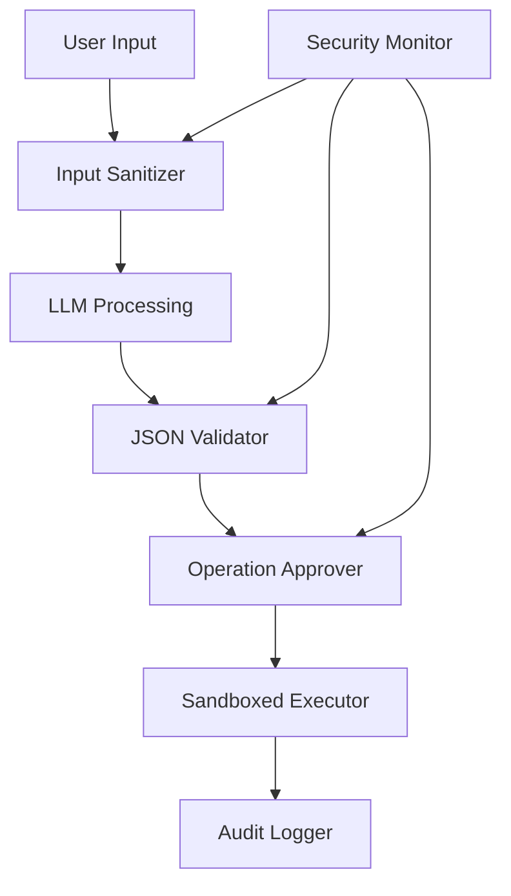

# ADR-002: セキュリティアーキテクチャ

## ステータス
承認済み

## 背景
システムはローカルPC上でユーザー指示を実行するため、不正または有害な操作を防ぐための堅牢なセキュリティが必要です。

## 決定
入力検証、操作承認、監査ログによる防御深度を実装します。

**セキュリティ層:**
1. **入力サニタイズ**: LLM処理前にユーザー入力を検証
2. **LLMガードレール**: Claudeの組み込み安全機能とプロンプトエンジニアリングを使用
3. **操作検証**: MCPサーバーが許可された操作に対してJSON指示を検証
4. **実行サンドボックス化**: 制限された環境で操作を実行
5. **監査ログ**: 操作履歴を含む暗号化ログ

## 影響

### 肯定的
- 悪意ある実行を防ぐ
- ユーザー信頼を維持
- エンタープライズ環境でのコンプライアンスを可能に
- フォレンジック機能を備える

### 否定的
- 検証によるパフォーマンスオーバーヘッド
- 誤検知がユーザーを苛立たせる可能性
- 追加の開発複雑性

### 中立的
- 継続的なセキュリティ監視が必要

## 実装

## 監視
- 検証失敗試行
- 操作承認率
- 実行エラー
- ログアクセスパターン