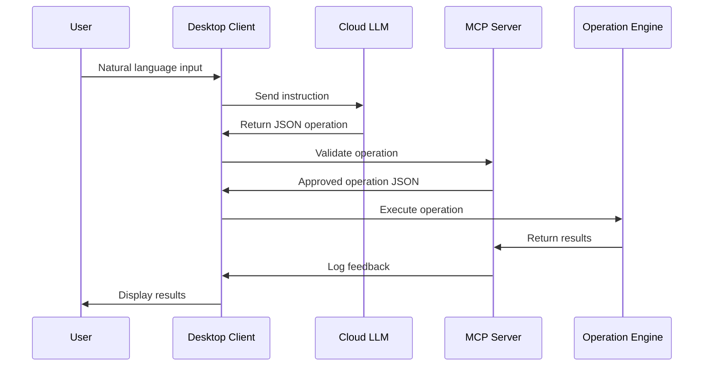

# ADR-004: 更新アーキテクチャ分析

## ステータス
承認済み

## 背景
ユーザーが提供した詳細なアーキテクチャ図は、.NETベースの実装で分離されたコンポーネントを示しています。これは初期のElectronベース設計からWindowsネイティブソリューションへの進化を表します。

## 決定
保守性とセキュリティの改良とともに、提供されたアーキテクチャを主要実装経路として採用します。

**主要コンポーネント:**
- **デスクトップAIクライアント**: WPF/WinForms/MAUIによるネイティブWindows体験
- **クラウドLLM**: 指示解析のためのGPTベースAPI
- **ローカルMCPサーバー**: スキル管理と安全のためのASP.NET Core Web API
- **操作エンジン**: 実際の実行のためのC# Process/Interop

## 影響

### 肯定的
- **Windows最適化**: ネイティブフレームワークがより良い統合を提供
- **.NETエコシステム**: 統一されたテクノロジースタックが開発生産性を向上
- **コンポーネント分離**: 明確な境界が独立したスケーリングを可能に
- **実行安全性**: 専用エンジンが細かい制御を可能に

### 否定的
- **プラットフォームロックイン**: Windows専用が広範な採用を制限
- **複雑性**: 複数の通信層が保守負担を増加
- **開発オーバーヘッド**: 複数の.NETテクノロジーの専門知識が必要

### 中立的
- **パフォーマンス**: ネイティブ実行がクロスプラットフォーム代替を上回る可能性
- **エンタープライズ採用**: 馴染みのある.NETスタックが企業展開を支援

## 実装

## 監視
- コンポーネント間遅延
- 操作成功率
- MCP検証精度
- コンポーネント間のメモリ使用量