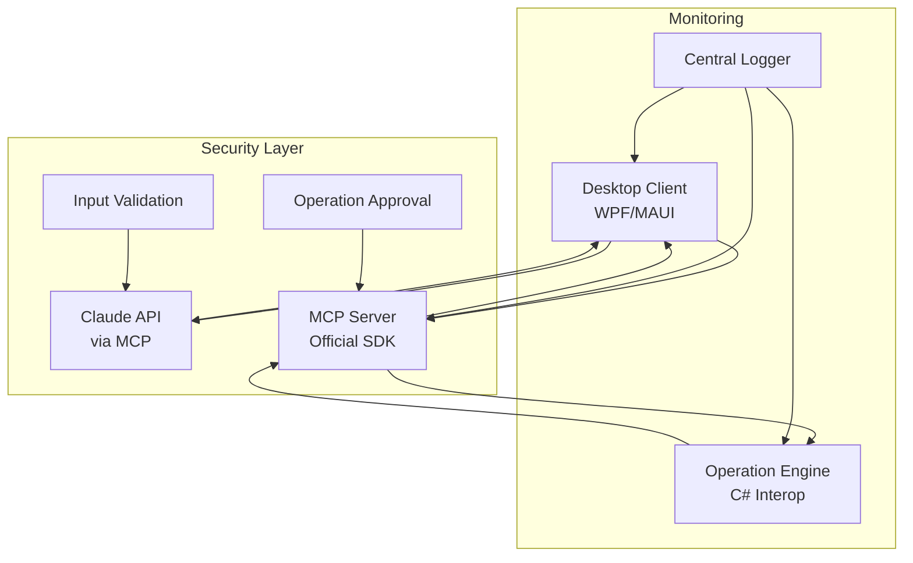

# ADR-006: アーキテクチャ改善

## ステータス
承認済み

## 背景
提供された.NETアーキテクチャは強固な基盤を持っていますが、保守性、セキュリティ、パフォーマンスをより良くするために強化できます。

## 決定
コアの.NETアーキテクチャを維持しつつ、以下の改良を実装します:

**主要改良:**
1. **MCP標準化**: カスタムASP.NET MCPを公式Microsoft/Anthropic MCP SDK (ModelContextProtocol NuGetパッケージ) に置き換え
2. **LLM統合**: ネイティブMCPサポートとより良いJSON生成のためにClaude APIに切り替え
3. **通信プロトコル**: SDKのデフォルト通信プロトコル (Stdio/HTTP) を使用し、必要に応じてgRPCを検討
4. **エラーハンドリング**: 包括的なエラー伝播とユーザー通知を実装
5. **テスト戦略**: 信頼性のために統合テストとカオスエンジニアリングを追加

## 影響

### 肯定的
- **標準準拠**: 公式MCP SDKが互換性とセキュリティ更新を保証
- **パフォーマンス**: 公式SDKが最適化された通信を提供
- **信頼性**: より良いエラーハンドリングがユーザー体験を向上
- **保守性**: 標準化されたコンポーネントが技術的負債を削減
- **開発効率**: Microsoftの公式SDKにより迅速な開発が可能

### 否定的
- **移行労力**: MCP実装の切り替えにリファクタリングが必要
- **学習曲線**: Claude統合が複雑性を追加
- **コスト**: Claude APIがGPTとは異なる料金体系の可能性

### 中立的
- **開発時間**: 初期オーバーヘッドが長期利益で相殺
- **プラットフォーム**: .NETエコシステム内での一貫性向上

## 実装
**更新アーキテクチャ:**



**移行戦略:**
1. Phase 1: ModelContextProtocol NuGetパッケージ導入と基本サーバー実装 (2週間)
2. Phase 2: Claude API統合 (1週間)
3. Phase 3: エラーハンドリングとセキュリティ強化 (1週間)
4. Phase 4: 統合テストとパフォーマンス最適化 (1週間)

**SDK使用例:**
```csharp
// MCPサーバーの基本実装
builder.Services
    .AddMcpServer()
    .WithStdioServerTransport()
    .WithToolsFromAssembly();

// ツール定義
[McpServerToolType]
public static class FileOperations
{
    [McpServerTool, Description("ファイルを指定場所に移動します")]
    public static string MoveFile(string sourcePath, string destinationPath)
    {
        // 実装
    }
}
```

## 監視
- MCPツール呼び出し成功率
- Claude API応答時間
- エラー率と種類
- コンポーネント間のメモリとCPU使用量
- セキュリティインシデント検知