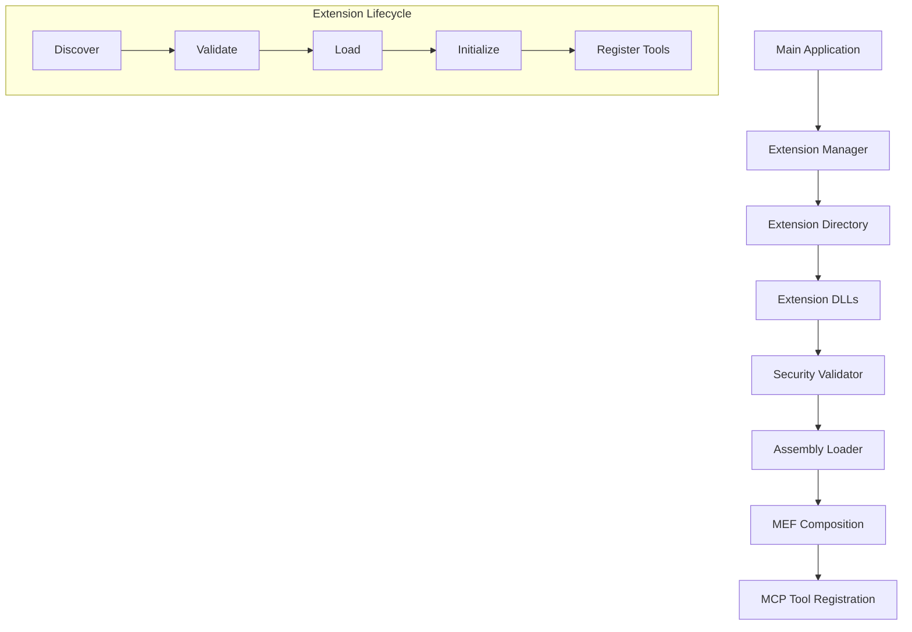

# ADR-007: MCPサーバー拡張性アーキテクチャ

## ステータス
承認済み

## 背景
MCPサーバーをエクステンションとしてダイナミックにロードできるようにすることで、メインロジックを変更せずに機能を拡張可能にします。これにより、ユーザーがカスタムツールを追加したり、サードパーティ拡張をインストールできるようになります。

## 決定
MEF (Managed Extensibility Framework) と動的アセンブリロードを組み合わせた拡張性アーキテクチャを採用します。

**主要コンポーネント:**
- **拡張マネージャ**: 拡張の検出・ロード・管理
- **拡張インターフェース**: MCP拡張の標準インターフェース
- **拡張ディレクトリ**: 拡張DLLの格納場所
- **セキュリティ検証**: 拡張の信頼性チェック

## 影響

### 肯定的
- **モジュール化**: コアシステムと拡張を分離
- **拡張性**: 再コンパイルなしで新機能追加可能
- **保守性**: 拡張の独立したライフサイクル管理
- **コミュニティ貢献**: サードパーティ拡張の容易な開発

### 否定的
- **複雑性**: 拡張ローディングの追加実装が必要
- **セキュリティリスク**: 悪意ある拡張の潜在的リスク
- **パフォーマンスオーバーヘッド**: 動的ロードによる初期化遅延

### 中立的
- **学習曲線**: 開発者が拡張APIを理解する必要
- **テスト**: 拡張の統合テストが必要

## 実装

### 拡張インターフェース
```csharp
public interface IMcpExtension
{
    string Name { get; }
    string Version { get; }
    IEnumerable<McpServerToolType> ToolTypes { get; }
    Task InitializeAsync(IServiceProvider services);
}

[Export(typeof(IMcpExtension))]
public class FileOperationsExtension : IMcpExtension
{
    // 拡張実装
}
```

### 拡張マネージャ
```csharp
public class ExtensionManager
{
    private readonly CompositionContainer _container;
    
    public async Task LoadExtensionsAsync(string extensionDirectory)
    {
        var assemblies = Directory.GetFiles(extensionDirectory, "*.dll")
            .Select(Assembly.LoadFrom);
            
        var catalog = new AggregateCatalog(
            assemblies.Select(a => new AssemblyCatalog(a)));
            
        _container = new CompositionContainer(catalog);
        
        var extensions = _container.GetExportedValues<IMcpExtension>();
        
        foreach (var extension in extensions)
        {
            await extension.InitializeAsync(_serviceProvider);
            RegisterTools(extension.ToolTypes);
        }
    }
}
```

### アーキテクチャ図


## 監視
- 拡張ロード成功率
- 拡張実行エラー
- セキュリティ違反検知
- パフォーマンス影響測定