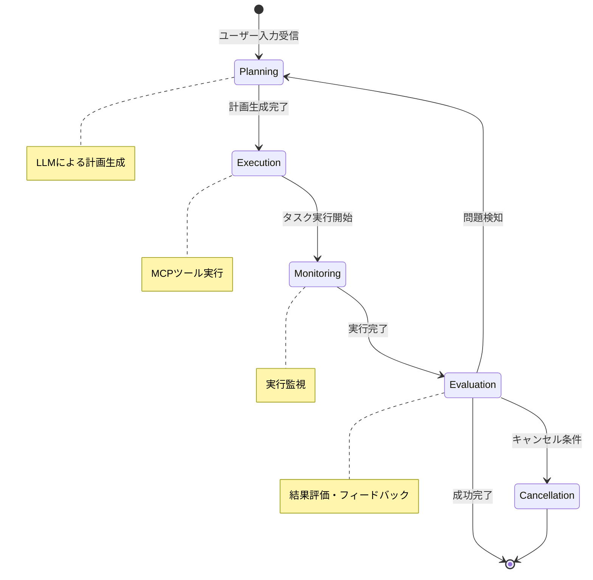

# ADR-008: 自律エージェント実行アーキテクチャ

## ステータス
承認済み

## 背景
LLMへの問い合わせからタスク実行をゼロショットで行い、実行計画の立案、実行、フィードバックによる計画修正、完了/キャンセルまで確実に実行できる自律エージェントシステムを実装します。

## 決定
ReActパターンに基づいた自律エージェント実行ループを採用し、以下のコンポーネントで構成します：

**主要コンポーネント:**
- **Agent Orchestrator**: エージェント実行ループの全体管理
- **Task Planner**: LLMによる実行計画の生成・修正
- **Execution Monitor**: タスク実行の監視と結果評価
- **State Manager**: エージェント状態と実行履歴の管理

## 影響

### 肯定的
- **自律性**: ユーザーの最小介入で複雑タスクを実行
- **適応性**: 実行中の問題に対応して計画を動的に修正
- **信頼性**: 完了/キャンセルまで確実に実行を継続
- **拡張性**: 新しいツールの自動統合が可能

### 否定的
- **複雑性**: 多層的な制御ロジックの実装が必要
- **パフォーマンス**: LLM呼び出しの繰り返しによる遅延
- **デバッグ難易度**: 非決定論的動作のトラブルシューティング

### 中立的
- **学習曲線**: 開発者がエージェントパターンを理解する必要

## 実装

### エージェント実行ループ


### 主要クラス設計

```csharp
public class AgentOrchestrator
{
    private readonly ITaskPlanner _planner;
    private readonly IExecutionMonitor _monitor;
    private readonly IStateManager _stateManager;
    
    public async Task<ExecutionResult> ExecuteTaskAsync(string userInput)
    {
        var context = new AgentContext { UserInput = userInput };
        
        while (!context.IsCompleted && !context.IsCancelled)
        {
            // 計画フェーズ
            var plan = await _planner.GeneratePlanAsync(context);
            context.CurrentPlan = plan;
            
            // 実行フェーズ
            var result = await ExecutePlanAsync(plan, context);
            
            // 評価フェーズ
            var evaluation = await _monitor.EvaluateResultAsync(result, context);
            
            if (evaluation.ShouldRetry)
            {
                context.AddFeedback(evaluation.Feedback);
                continue;
            }
            
            if (evaluation.IsSuccessful)
            {
                context.MarkCompleted();
            }
            else
            {
                context.MarkCancelled(evaluation.Reason);
            }
        }
        
        return context.ToResult();
    }
}

public class TaskPlanner
{
    private readonly IClaudeClient _claude;
    
    public async Task<ExecutionPlan> GeneratePlanAsync(AgentContext context)
    {
        var prompt = BuildPlanningPrompt(context);
        var response = await _claude.GenerateAsync(prompt);
        
        return ParsePlanFromResponse(response);
    }
}

public class ExecutionMonitor
{
    public async Task<EvaluationResult> EvaluateResultAsync(
        ExecutionResult result, AgentContext context)
    {
        // 実行結果の検証
        var issues = await ValidateExecutionResult(result);
        
        if (issues.Any())
        {
            return new EvaluationResult
            {
                ShouldRetry = true,
                Feedback = GenerateFeedback(issues)
            };
        }
        
        return new EvaluationResult { IsSuccessful = true };
    }
}
```

### 実行計画構造
```csharp
public class ExecutionPlan
{
    public string Description { get; set; }
    public List<ExecutionStep> Steps { get; set; }
    public Dictionary<string, object> Parameters { get; set; }
}

public class ExecutionStep
{
    public string ToolName { get; set; }
    public Dictionary<string, object> Arguments { get; set; }
    public string ExpectedOutcome { get; set; }
    public TimeSpan Timeout { get; set; }
}
```

### 状態管理
```csharp
public class AgentContext
{
    public string UserInput { get; set; }
    public ExecutionPlan CurrentPlan { get; set; }
    public List<ExecutionResult> ExecutionHistory { get; set; }
    public List<string> FeedbackHistory { get; set; }
    public bool IsCompleted { get; private set; }
    public bool IsCancelled { get; private set; }
    public string CancellationReason { get; private set; }
    
    public void AddFeedback(string feedback)
    {
        FeedbackHistory.Add(feedback);
    }
    
    public void MarkCompleted()
    {
        IsCompleted = true;
    }
    
    public void MarkCancelled(string reason)
    {
        IsCancelled = true;
        CancellationReason = reason;
    }
}
```

## 監視
- 実行ループの完了率
- 計画修正の頻度
- LLM呼び出しの回数とコスト
- 実行タイムアウトとエラー率
- ユーザー満足度指標