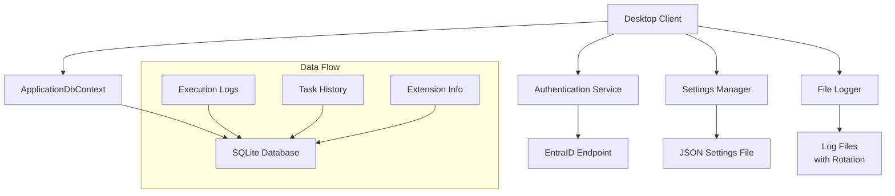

# ADR-010: データストレージと認証アーキテクチャ

## ステータス
承認済み

## 背景
ADR-009で特定されたデータストレージと認証・認可の不足項目について、具体的な実装方法を決定します。

## 決定
ユーザーの指定に基づき、以下の技術スタックを採用します：

**データストレージ:**
- ローカルDB: SQLite
- 設定管理: JSONファイル
- ログストレージ: テキストファイル（ログローテーション）

**認証・認可:**
- EntraIDアプリによる認証
- 認証エンドポイント: 既存実装を使用

## 影響

### 肯定的
- **互換性**: 指定された技術との統合が容易
- **シンプルさ**: 複雑さを避けた実装
- **既存資産活用**: 認証エンドポイントの再利用

### 否定的
- **スケーラビリティ制限**: SQLiteの単一ユーザー制約
- **セキュリティ依存**: EntraIDのセキュリティモデルに依存

### 中立的
- **実装速度**: 迅速なPoC開発が可能

## 実装

### SQLiteデータベース設計
```csharp
// Entity Framework Coreを使用したSQLite設定
public class ApplicationDbContext : DbContext
{
    public DbSet<ExecutionLog> ExecutionLogs { get; set; }
    public DbSet<TaskHistory> TaskHistories { get; set; }
    public DbSet<ExtensionInfo> Extensions { get; set; }
    
    protected override void OnConfiguring(DbContextOptionsBuilder options)
    {
        var dbPath = Path.Combine(
            Environment.GetFolderPath(Environment.SpecialFolder.LocalApplicationData),
            "Commanda",
            "commanda.db"
        );
        options.UseSqlite($"Data Source={dbPath}");
    }
}

// エンティティ例
public class ExecutionLog
{
    public int Id { get; set; }
    public DateTime Timestamp { get; set; }
    public string UserId { get; set; }
    public string TaskDescription { get; set; }
    public string Status { get; set; }
    public string Result { get; set; }
    public TimeSpan Duration { get; set; }
}
```

### JSON設定管理
```csharp
public class AppSettings
{
    public ClaudeSettings Claude { get; set; }
    public UiSettings Ui { get; set; }
    public ExtensionSettings Extensions { get; set; }
}

public class SettingsManager
{
    private readonly string _settingsPath;
    
    public SettingsManager()
    {
        var appData = Environment.GetFolderPath(Environment.SpecialFolder.LocalApplicationData);
        _settingsPath = Path.Combine(appData, "Commanda", "settings.json");
    }
    
    public async Task<AppSettings> LoadAsync()
    {
        if (!File.Exists(_settingsPath))
            return new AppSettings();
            
        var json = await File.ReadAllTextAsync(_settingsPath);
        return JsonSerializer.Deserialize<AppSettings>(json) ?? new AppSettings();
    }
    
    public async Task SaveAsync(AppSettings settings)
    {
        var json = JsonSerializer.Serialize(settings, new JsonSerializerOptions 
        { 
            WriteIndented = true 
        });
        
        Directory.CreateDirectory(Path.GetDirectoryName(_settingsPath)!);
        await File.WriteAllTextAsync(_settingsPath, json);
    }
}
```

### ログストレージ（ローテーション）
```csharp
public class FileLogger
{
    private readonly string _logDirectory;
    private readonly long _maxFileSize = 10 * 1024 * 1024; // 10MB
    private readonly int _maxFiles = 10;
    
    public FileLogger()
    {
        var appData = Environment.GetFolderPath(Environment.SpecialFolder.LocalApplicationData);
        _logDirectory = Path.Combine(appData, "Commanda", "logs");
        Directory.CreateDirectory(_logDirectory);
    }
    
    public async Task LogAsync(LogLevel level, string message, Exception? exception = null)
    {
        var logFile = GetCurrentLogFile();
        
        // ローテーション判定
        if (ShouldRotate(logFile))
        {
            RotateLogFiles();
            logFile = GetCurrentLogFile();
        }
        
        var logEntry = new LogEntry
        {
            Timestamp = DateTime.UtcNow,
            Level = level,
            Message = message,
            Exception = exception?.ToString()
        };
        
        var json = JsonSerializer.Serialize(logEntry) + Environment.NewLine;
        await File.AppendAllTextAsync(logFile, json);
    }
    
    private string GetCurrentLogFile() => 
        Path.Combine(_logDirectory, "commanda.log");
    
    private bool ShouldRotate(string filePath) =>
        File.Exists(filePath) && new FileInfo(filePath).Length > _maxFileSize;
    
    private void RotateLogFiles()
    {
        // 既存ファイルをローテーション
        for (int i = _maxFiles - 1; i > 0; i--)
        {
            var currentFile = Path.Combine(_logDirectory, $"commanda.{i}.log");
            var nextFile = Path.Combine(_logDirectory, $"commanda.{i + 1}.log");
            
            if (File.Exists(currentFile))
                File.Move(currentFile, nextFile, true);
        }
        
        var mainLog = GetCurrentLogFile();
        if (File.Exists(mainLog))
            File.Move(mainLog, Path.Combine(_logDirectory, "commanda.1.log"));
    }
}

public class LogEntry
{
    public DateTime Timestamp { get; set; }
    public LogLevel Level { get; set; }
    public string Message { get; set; }
    public string? Exception { get; set; }
}
```

### EntraID認証統合
```csharp
public class AuthenticationService
{
    private readonly HttpClient _httpClient;
    private readonly string _authEndpoint;
    
    public AuthenticationService(string authEndpoint)
    {
        _httpClient = new HttpClient();
        _authEndpoint = authEndpoint;
    }
    
    public async Task<AuthenticationResult> AuthenticateAsync(string token)
    {
        var request = new HttpRequestMessage(HttpMethod.Post, _authEndpoint);
        request.Headers.Authorization = new AuthenticationHeaderValue("Bearer", token);
        
        var response = await _httpClient.SendAsync(request);
        
        if (response.IsSuccessStatusCode)
        {
            var content = await response.Content.ReadAsStringAsync();
            var userInfo = JsonSerializer.Deserialize<UserInfo>(content);
            
            return new AuthenticationResult
            {
                IsAuthenticated = true,
                UserId = userInfo?.Id,
                Permissions = userInfo?.Permissions ?? new List<string>()
            };
        }
        
        return new AuthenticationResult { IsAuthenticated = false };
    }
}

public class UserInfo
{
    public string Id { get; set; }
    public List<string> Permissions { get; set; }
}
```

### アーキテクチャ統合


## 監視
- SQLiteデータベースのパフォーマンス（クエリ時間、サイズ）
- ログファイルのローテーション頻度とサイズ
- EntraID認証の成功率とレスポンスタイム
- JSON設定ファイルの読み書きエラー