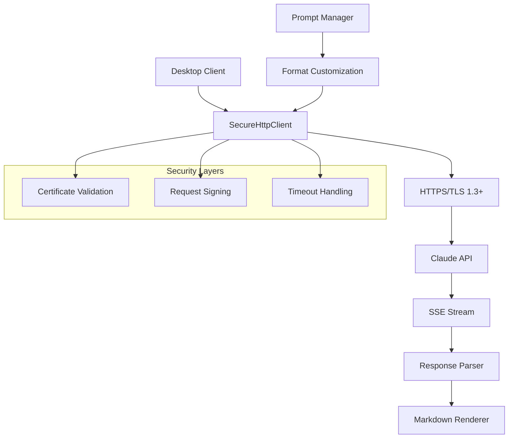

# ADR-011: ネットワークセキュリティと通信アーキテクチャ

## ステータス
承認済み

## 背景
ADR-009で特定されたネットワークセキュリティについて、HTTPS接続、SSE通信、マークダウンレスポンスの実装を決定します。

## 決定
以下の通信プロトコルとセキュリティ仕様を採用：

**ネットワークセキュリティ:**
- HTTPS/TLS 1.3以上を使用
- 証明書検証の厳格化
- タイムアウトとリトライ設定

**通信プロトコル:**
- SSE (Server-Sent Events) for リアルタイム応答
- マークダウン形式のレスポンス（デフォルト）
- プロンプトによる応答形式のカスタマイズ

## 影響

### 肯定的
- **セキュリティ強化**: HTTPSによる暗号化通信
- **リアルタイム性**: SSEによるストリーミング応答
- **柔軟性**: プロンプトによる形式変更可能
- **互換性**: 標準的なWebプロトコル使用

### 否定的
- **実装複雑性**: SSEハンドリングの追加
- **ブラウザ依存**: SSEのクライアント側サポート

### 中立的
- **パフォーマンス**: ストリーミングによる応答速度向上

## 実装

### HTTPS接続設定
```csharp
public class SecureHttpClientFactory
{
    public static HttpClient CreateSecureClient()
    {
        var handler = new HttpClientHandler
        {
            // TLS 1.3以上を要求
            SslProtocols = SslProtocols.Tls13 | SslProtocols.Tls12,
            
            // 証明書検証の厳格化
            ServerCertificateCustomValidationCallback = (message, cert, chain, errors) =>
            {
                // 証明書チェーン検証
                if (errors != SslPolicyErrors.None)
                {
                    // 詳細な検証ロジック
                    return ValidateCertificate(cert, chain, errors);
                }
                return true;
            },
            
            // プロキシ設定（企業環境対応）
            UseProxy = true,
            Proxy = GetSystemProxy()
        };
        
        var client = new HttpClient(handler)
        {
            Timeout = TimeSpan.FromSeconds(30)
        };
        
        // デフォルトヘッダー設定
        client.DefaultRequestHeaders.Add("User-Agent", "Commanda/1.0");
        
        return client;
    }
    
    private static bool ValidateCertificate(X509Certificate2 cert, X509Chain chain, SslPolicyErrors errors)
    {
        // 証明書の詳細検証
        // - 有効期限チェック
        // - 発行者検証
        // - 失効チェック（CRL/OCSP）
        return cert.Verify() && chain.Build(cert);
    }
    
    private static IWebProxy GetSystemProxy()
    {
        return WebRequest.GetSystemWebProxy();
    }
}
```

### SSE通信実装
```csharp
public class ClaudeSseClient
{
    private readonly HttpClient _httpClient;
    private readonly string _apiEndpoint;
    
    public ClaudeSseClient(HttpClient httpClient, string apiEndpoint)
    {
        _httpClient = httpClient;
        _apiEndpoint = apiEndpoint;
    }
    
    public async IAsyncEnumerable<ClaudeResponse> StreamResponseAsync(
        string prompt, 
        string systemPrompt = null,
        ResponseFormat format = ResponseFormat.Markdown)
    {
        var request = new HttpRequestMessage(HttpMethod.Post, _apiEndpoint);
        request.Headers.Authorization = new AuthenticationHeaderValue("Bearer", _apiKey);
        request.Headers.Accept.Add(new MediaTypeWithQualityHeaderValue("text/event-stream"));
        
        var requestBody = new
        {
            prompt = BuildFullPrompt(prompt, systemPrompt, format),
            stream = true,
            max_tokens = 4096
        };
        
        request.Content = new StringContent(
            JsonSerializer.Serialize(requestBody), 
            Encoding.UTF8, 
            "application/json");
        
        using var response = await _httpClient.SendAsync(
            request, 
            HttpCompletionOption.ResponseHeadersRead);
        
        response.EnsureSuccessStatusCode();
        
        using var stream = await response.Content.ReadAsStreamAsync();
        using var reader = new StreamReader(stream);
        
        string line;
        while ((line = await reader.ReadLineAsync()) != null)
        {
            if (string.IsNullOrWhiteSpace(line)) continue;
            
            if (line.StartsWith("data: "))
            {
                var data = line.Substring(6);
                if (data == "[DONE]") break;
                
                var chunk = JsonSerializer.Deserialize<SseChunk>(data);
                if (chunk != null)
                {
                    yield return new ClaudeResponse
                    {
                        Content = chunk.Choices[0].Delta.Content,
                        IsComplete = false
                    };
                }
            }
        }
        
        yield return new ClaudeResponse { IsComplete = true };
    }
    
    private string BuildFullPrompt(string userPrompt, string systemPrompt, ResponseFormat format)
    {
        var system = systemPrompt ?? GetDefaultSystemPrompt(format);
        return $"{system}\n\nUser: {userPrompt}\n\nAssistant: ";
    }
    
    private string GetDefaultSystemPrompt(ResponseFormat format)
    {
        return format switch
        {
            ResponseFormat.Markdown => "You are a helpful AI assistant. Respond in Markdown format.",
            ResponseFormat.JSON => "You are a helpful AI assistant. Respond in valid JSON format.",
            ResponseFormat.PlainText => "You are a helpful AI assistant. Respond in plain text.",
            _ => "You are a helpful AI assistant."
        };
    }
}

public enum ResponseFormat
{
    Markdown,
    JSON,
    PlainText,
    Custom
}

public class SseChunk
{
    public List<Choice> Choices { get; set; }
}

public class Choice
{
    public Delta Delta { get; set; }
}

public class Delta
{
    public string Content { get; set; }
}

public class ClaudeResponse
{
    public string Content { get; set; }
    public bool IsComplete { get; set; }
}
```

### 応答形式のカスタマイズ
```csharp
public class PromptManager
{
    public string CustomizeSystemPrompt(
        string basePrompt, 
        ResponseFormat format, 
        Dictionary<string, object> customizations)
    {
        var prompt = basePrompt;
        
        // 応答形式の指定
        switch (format)
        {
            case ResponseFormat.Markdown:
                prompt += "\nRespond in Markdown format with proper headers, lists, and code blocks.";
                break;
            case ResponseFormat.JSON:
                prompt += "\nRespond with valid JSON. Structure your answer as a JSON object.";
                break;
            case ResponseFormat.PlainText:
                prompt += "\nRespond in plain text without any formatting.";
                break;
        }
        
        // カスタム指示の追加
        if (customizations.TryGetValue("maxLength", out var maxLength))
        {
            prompt += $"\nKeep your response under {maxLength} characters.";
        }
        
        if (customizations.TryGetValue("language", out var language))
        {
            prompt += $"\nRespond in {language} language.";
        }
        
        if (customizations.TryGetValue("tone", out var tone))
        {
            prompt += $"\nUse a {tone} tone in your response.";
        }
        
        return prompt;
    }
}
```

### 通信アーキテクチャ


## 監視
- HTTPS接続の成功率と証明書検証エラー
- SSEストリームのレイテンシーと中断率
- 応答形式のカスタマイズ成功率
- ネットワークタイムアウトとリトライ回数