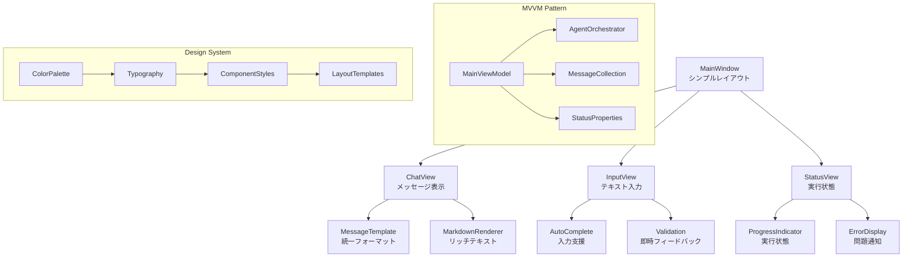

# ADR-012: UI/UXアーキテクチャ

## ステータス
承認済み

## 背景
ADR-009で特定されたUI/UX設計について、シンプルでモダンなレイアウトと複雑さ排除の方針を決定します。

## 決定
以下のUI/UX原則を採用：

**デザイン原則:**
- シンプルさとモダンなレイアウト
- 複雑な操作の極力排除
- 直感的なユーザー体験
- アクセシビリティ重視

**実装フレームワーク:**
- WPF/MAUI with Material Design
- MVVMパターン
- レスポンシブレイアウト

## 影響

### 肯定的
- **使いやすさ**: 学習コストの低減
- **効率性**: タスク完了時間の短縮
- **アクセシビリティ**: 幅広いユーザー対応
- **保守性**: 一貫したデザインシステム

### 否定的
- **表現力制限**: シンプルさによる機能制約
- **カスタマイズ性低下**: 標準化による柔軟性減少

### 中立的
- **開発効率**: デザインシステムによる一貫性確保

## 実装

### 全体レイアウト設計
```xaml
<!-- MainWindow.xaml -->
<Window x:Class="Commanda.MainWindow"
        xmlns="http://schemas.microsoft.com/winfx/2006/xaml/presentation"
        xmlns:x="http://schemas.microsoft.com/winfx/2006/xaml"
        xmlns:d="http://schemas.microsoft.com/expression/blend/2008"
        xmlns:mc="http://schemas.openxmlformats.org/markup-compatibility/2006"
        xmlns:local="clr-namespace:Commanda"
        mc:Ignorable="d"
        Title="Commanda" Height="700" Width="1000"
        WindowStartupLocation="CenterScreen"
        Background="{StaticResource PrimaryBackgroundBrush}">
    
    <Grid>
        <!-- シンプルな3ペイン構成 -->
        <Grid.RowDefinitions>
            <RowDefinition Height="Auto"/>
            <RowDefinition Height="*"/>
            <RowDefinition Height="Auto"/>
        </Grid.RowDefinitions>
        
        <!-- ヘッダー: 最小限のコントロール -->
        <Border Grid.Row="0" Background="{StaticResource PrimaryBrush}" Padding="16,8">
            <Grid>
                <Grid.ColumnDefinitions>
                    <ColumnDefinition Width="Auto"/>
                    <ColumnDefinition Width="*"/>
                    <ColumnDefinition Width="Auto"/>
                </Grid.ColumnDefinitions>
                
                <TextBlock Grid.Column="0" Text="Commanda" 
                          FontSize="18" FontWeight="SemiBold" 
                          Foreground="{StaticResource PrimaryForegroundBrush}"/>
                
                <!-- 設定ボタンのみ（ドロップダウンで詳細設定） -->
                <Button Grid.Column="2" Content="⚙" 
                       Style="{StaticResource IconButtonStyle}"
                       Command="{Binding ShowSettingsCommand}"/>
            </Grid>
        </Border>
        
        <!-- メインコンテンツ: チャットインターフェース -->
        <Grid Grid.Row="1">
            <Grid.ColumnDefinitions>
                <ColumnDefinition Width="*"/>
                <ColumnDefinition Width="300"/>
            </Grid.ColumnDefinitions>
            
            <!-- チャットエリア -->
            <ScrollViewer Grid.Column="0" x:Name="ChatScrollViewer">
                <ItemsControl ItemsSource="{Binding Messages}" 
                             ItemTemplate="{StaticResource MessageTemplate}"/>
            </ScrollViewer>
            
            <!-- サイドバー: 実行状態表示 -->
            <Border Grid.Column="1" Background="{StaticResource SecondaryBackgroundBrush}" 
                   BorderBrush="{StaticResource BorderBrush}" BorderThickness="1,0,0,0">
                <local:ExecutionStatusView/>
            </Border>
        </Grid>
        
        <!-- フッター: 入力エリア -->
        <Border Grid.Row="2" Background="{StaticResource PrimaryBackgroundBrush}" 
               BorderBrush="{StaticResource BorderBrush}" BorderThickness="0,1,0,0" 
               Padding="16">
            <Grid>
                <Grid.ColumnDefinitions>
                    <ColumnDefinition Width="*"/>
                    <ColumnDefinition Width="Auto"/>
                </Grid.ColumnDefinitions>
                
                <!-- シンプルなテキスト入力 -->
                <TextBox Grid.Column="0" 
                        Text="{Binding CurrentMessage, UpdateSourceTrigger=PropertyChanged}"
                        PlaceholderText="自然言語で指示を入力してください..."
                        Style="{StaticResource ModernTextBoxStyle}"
                        KeyDown="OnMessageKeyDown"/>
                
                <!-- 送信ボタン -->
                <Button Grid.Column="1" Content="送信" 
                       Style="{StaticResource PrimaryButtonStyle}"
                       Command="{Binding SendMessageCommand}"
                       Margin="8,0,0,0"/>
            </Grid>
        </Border>
    </Grid>
</Window>
```

### メッセージ表示テンプレート
```xaml
<!-- MessageTemplate -->
<DataTemplate x:Key="MessageTemplate">
    <Border Margin="16,8" Background="{StaticResource MessageBackgroundBrush}" 
           CornerRadius="8" Padding="12" MaxWidth="600">
        <Grid>
            <Grid.ColumnDefinitions>
                <ColumnDefinition Width="Auto"/>
                <ColumnDefinition Width="*"/>
            </Grid.ColumnDefinitions>
            
            <!-- アバター -->
            <Border Grid.Column="0" Width="32" Height="32" 
                   CornerRadius="16" Margin="0,0,12,0">
                <TextBlock Text="{Binding SenderInitial}" 
                          HorizontalAlignment="Center" VerticalAlignment="Center"
                          FontWeight="Bold" Foreground="{StaticResource PrimaryForegroundBrush}"/>
            </Border>
            
            <!-- メッセージ内容 -->
            <StackPanel Grid.Column="1">
                <TextBlock Text="{Binding SenderName}" FontWeight="SemiBold" 
                          Margin="0,0,0,4"/>
                
                <!-- マークダウンレンダリング -->
                <local:MarkdownTextBlock Text="{Binding Content}" 
                                       FontSize="14" LineHeight="1.4"/>
                
                <TextBlock Text="{Binding Timestamp, StringFormat='{}{0:HH:mm}'}" 
                          FontSize="11" Foreground="{StaticResource SecondaryTextBrush}"
                          Margin="0,4,0,0"/>
            </StackPanel>
        </Grid>
    </Border>
</DataTemplate>
```

### 実行状態ビュー
```csharp
public class ExecutionStatusView : UserControl
{
    public ExecutionStatusView()
    {
        InitializeComponent();
    }
    
    private void InitializeComponent()
    {
        // シンプルな状態表示
        var statusText = new TextBlock
        {
            Text = "準備完了",
            FontSize = 14,
            HorizontalAlignment = HorizontalAlignment.Center,
            Margin = new Thickness(16)
        };
        
        // プログレスバー（実行中のみ表示）
        var progressBar = new ProgressBar
        {
            IsIndeterminate = true,
            Visibility = Visibility.Collapsed,
            Height = 4,
            Margin = new Thickness(16, 0, 16, 16)
        };
        
        // 実行中のツール表示
        var currentToolText = new TextBlock
        {
            Text = "",
            FontSize = 12,
            Foreground = Brushes.Gray,
            TextWrapping = TextWrapping.Wrap,
            Margin = new Thickness(16, 0)
        };
        
        var stackPanel = new StackPanel();
        stackPanel.Children.Add(statusText);
        stackPanel.Children.Add(progressBar);
        stackPanel.Children.Add(currentToolText);
        
        Content = stackPanel;
        
        // ViewModelバインディング
        statusText.SetBinding(TextBlock.TextProperty, new Binding("StatusText"));
        progressBar.SetBinding(VisibilityProperty, new Binding("IsExecuting"));
        currentToolText.SetBinding(TextBlock.TextProperty, new Binding("CurrentTool"));
    }
}
```

### MVVMパターン実装
```csharp
public class MainViewModel : INotifyPropertyChanged
{
    private string _currentMessage;
    private ObservableCollection<MessageViewModel> _messages;
    private bool _isExecuting;
    private string _statusText = "準備完了";
    
    public string CurrentMessage
    {
        get => _currentMessage;
        set
        {
            _currentMessage = value;
            OnPropertyChanged();
            SendCommand.RaiseCanExecuteChanged();
        }
    }
    
    public ObservableCollection<MessageViewModel> Messages
    {
        get => _messages ??= new ObservableCollection<MessageViewModel>();
        set
        {
            _messages = value;
            OnPropertyChanged();
        }
    }
    
    public bool IsExecuting
    {
        get => _isExecuting;
        set
        {
            _isExecuting = value;
            OnPropertyChanged();
            StatusText = value ? "実行中..." : "準備完了";
        }
    }
    
    public string StatusText
    {
        get => _statusText;
        set
        {
            _statusText = value;
            OnPropertyChanged();
        }
    }
    
    public DelegateCommand SendCommand { get; }
    
    public MainViewModel()
    {
        SendCommand = new DelegateCommand(
            async () => await SendMessageAsync(), 
            () => !string.IsNullOrWhiteSpace(CurrentMessage) && !IsExecuting);
    }
    
    private async Task SendMessageAsync()
    {
        if (string.IsNullOrWhiteSpace(CurrentMessage)) return;
        
        var userMessage = new MessageViewModel
        {
            SenderName = "あなた",
            SenderInitial = "U",
            Content = CurrentMessage,
            Timestamp = DateTime.Now
        };
        
        Messages.Add(userMessage);
        var messageToSend = CurrentMessage;
        CurrentMessage = "";
        
        IsExecuting = true;
        
        try
        {
            // エージェント実行
            var result = await _agentOrchestrator.ExecuteTaskAsync(messageToSend);
            
            var aiMessage = new MessageViewModel
            {
                SenderName = "Commanda",
                SenderInitial = "C",
                Content = result.Content,
                Timestamp = DateTime.Now
            };
            
            Messages.Add(aiMessage);
        }
        catch (Exception ex)
        {
            var errorMessage = new MessageViewModel
            {
                SenderName = "システム",
                SenderInitial = "S",
                Content = $"エラーが発生しました: {ex.Message}",
                Timestamp = DateTime.Now
            };
            
            Messages.Add(errorMessage);
        }
        finally
        {
            IsExecuting = false;
        }
    }
    
    public event PropertyChangedEventHandler PropertyChanged;
    
    protected virtual void OnPropertyChanged([CallerMemberName] string propertyName = null)
    {
        PropertyChanged?.Invoke(this, new PropertyChangedEventArgs(propertyName));
    }
}
```

### デザインシステム
```csharp
// App.xaml
<Application.Resources>
    <!-- カラーパレット -->
    <SolidColorBrush x:Key="PrimaryBrush" Color="#6200EE"/>
    <SolidColorBrush x:Key="PrimaryBackgroundBrush" Color="#FAFAFA"/>
    <SolidColorBrush x:Key="SecondaryBackgroundBrush" Color="#F5F5F5"/>
    <SolidColorBrush x:Key="MessageBackgroundBrush" Color="#FFFFFF"/>
    <SolidColorBrush x:Key="BorderBrush" Color="#E0E0E0"/>
    
    <!-- テキストスタイル -->
    <Style x:Key="ModernTextBoxStyle" TargetType="TextBox">
        <Setter Property="FontSize" Value="14"/>
        <Setter Property="Padding" Value="12,8"/>
        <Setter Property="BorderThickness" Value="1"/>
        <Setter Property="BorderBrush" Value="{StaticResource BorderBrush}"/>
        <Setter Property="Background" Value="White"/>
        <Setter Property="Border.CornerRadius" Value="4"/>
    </Style>
    
    <Style x:Key="PrimaryButtonStyle" TargetType="Button">
        <Setter Property="Background" Value="{StaticResource PrimaryBrush}"/>
        <Setter Property="Foreground" Value="White"/>
        <Setter Property="FontWeight" Value="SemiBold"/>
        <Setter Property="Padding" Value="16,8"/>
        <Setter Property="BorderThickness" Value="0"/>
        <Setter Property="Border.CornerRadius" Value="4"/>
        <Style.Triggers>
            <Trigger Property="IsMouseOver" Value="True">
                <Setter Property="Opacity" Value="0.9"/>
            </Trigger>
        </Style.Triggers>
    </Style>
</Application.Resources>
```

### UI原則の実践

#### 1. シンプルさの確保
- 最小限のコントロール配置
- 直感的なレイアウト（チャット形式）
- ドロップダウン/折りたたみによる詳細設定

#### 2. 複雑さの排除
- ワンクリック/ワンキー操作
- 自動補完と提案
- エラーの自動回復

#### 3. モダンなデザイン
- Material Designインスパイア
- 十分なホワイトスペース
- 微妙な影と角丸

#### 4. アクセシビリティ
- キーボードナビゲーション
- 高コントラスト比
- スクリーンリーダー対応

### アーキテクチャ図


## 監視
- ユーザー操作の完了率と時間
- UIレスポンスのレイテンシー
- エラーメッセージの表示頻度
- アクセシビリティ機能の使用率