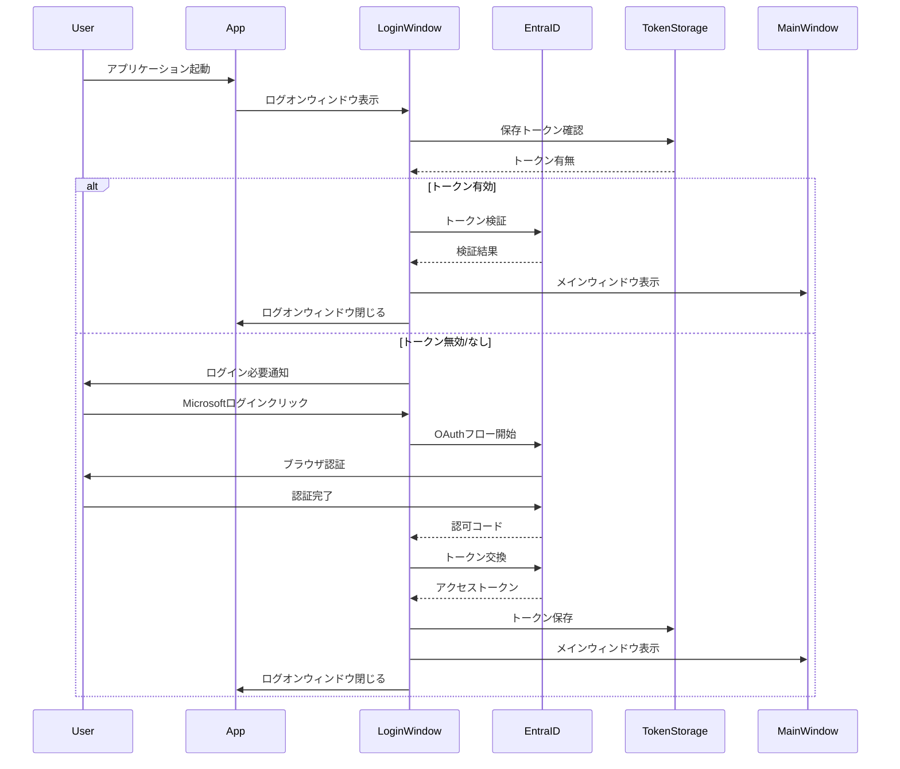

# ADR-013: ログオン画面アーキテクチャ

## ステータス
承認済み

## 背景
ADR-010で定義されたEntraID認証システムを実装するため、アプリケーション起動時のログオン画面を設計します。

## 決定
以下のログオン画面仕様を採用：

**認証方式:**
- Microsoft EntraID (OAuth 2.0 / OpenID Connect)
- 既存認証エンドポイントとの統合
- トークンの安全な保存

**UI設計:**
- シンプルで信頼できるログオン画面
- 自動ログイン機能（トークン有効時）
- エラーハンドリングとフィードバック

## 影響

### 肯定的
- **セキュリティ強化**: 明示的な認証プロセス
- **ユーザー信頼性**: 明確なログイン状態表示
- **統合性**: EntraIDエコシステムとの統合

### 否定的
- **起動時間増加**: 認証プロセスによる遅延
- **ユーザー摩擦**: ログイン手順の追加

### 中立的
- **コンプライアンス**: エンタープライズ認証標準遵守

## 実装

### ログオン画面レイアウト
```xaml
<!-- LoginWindow.xaml -->
<Window x:Class="Commanda.LoginWindow"
        xmlns="http://schemas.microsoft.com/winfx/2006/xaml/presentation"
        xmlns:x="http://schemas.microsoft.com/winfx/2006/xaml"
        xmlns:d="http://schemas.microsoft.com/expression/blend/2008"
        xmlns:mc="http://schemas.openxmlformats.org/markup-compatibility/2006"
        mc:Ignorable="d"
        Title="Commanda - ログイン" 
        Height="450" Width="400"
        WindowStartupLocation="CenterScreen"
        ResizeMode="NoResize"
        WindowStyle="None"
        Background="{StaticResource LoginBackgroundBrush}"
        AllowsTransparency="True">
    
    <Border CornerRadius="8" Background="White" BorderBrush="{StaticResource BorderBrush}" BorderThickness="1">
        <Grid Margin="40">
            <Grid.RowDefinitions>
                <RowDefinition Height="Auto"/>
                <RowDefinition Height="Auto"/>
                <RowDefinition Height="Auto"/>
                <RowDefinition Height="*"/>
                <RowDefinition Height="Auto"/>
            </Grid.RowDefinitions>
            
            <!-- アプリケーションアイコンとタイトル -->
            <StackPanel Grid.Row="0" HorizontalAlignment="Center" Margin="0,0,0,32">
                <Image Source="/Resources/CommandaIcon.png" Width="64" Height="64" Margin="0,0,0,16"/>
                <TextBlock Text="Commanda" FontSize="24" FontWeight="SemiBold" 
                          Foreground="{StaticResource PrimaryBrush}" HorizontalAlignment="Center"/>
                <TextBlock Text="安全なPC操作自動化" FontSize="14" 
                          Foreground="{StaticResource SecondaryTextBrush}" HorizontalAlignment="Center" Margin="0,4,0,0"/>
            </StackPanel>
            
            <!-- ログイン状態表示 -->
            <Border Grid.Row="1" Background="{StaticResource SecondaryBackgroundBrush}" 
                   CornerRadius="4" Padding="16" Margin="0,0,0,16">
                <TextBlock x:Name="StatusTextBlock" Text="認証情報を確認しています..." 
                          HorizontalAlignment="Center" TextWrapping="Wrap"/>
            </Border>
            
            <!-- プログレスインジケーター -->
            <ProgressBar Grid.Row="2" x:Name="LoginProgressBar" 
                        IsIndeterminate="True" Height="4" Margin="0,0,0,24"/>
            
            <!-- エラーメッセージ表示 -->
            <Border Grid.Row="3" x:Name="ErrorBorder" 
                   Background="{StaticResource ErrorBackgroundBrush}" 
                   CornerRadius="4" Padding="12" Margin="0,0,0,16" Visibility="Collapsed">
                <TextBlock x:Name="ErrorTextBlock" 
                          Foreground="{StaticResource ErrorTextBrush}" 
                          TextWrapping="Wrap"/>
            </Border>
            
            <!-- アクションボタン -->
            <StackPanel Grid.Row="4" Orientation="Horizontal" HorizontalAlignment="Center">
                <Button x:Name="LoginButton" Content="Microsoftでログイン" 
                       Style="{StaticResource PrimaryButtonStyle}"
                       Click="OnLoginButtonClick" Margin="0,0,8,0"/>
                
                <Button x:Name="CancelButton" Content="キャンセル" 
                       Style="{StaticResource SecondaryButtonStyle}"
                       Click="OnCancelButtonClick"/>
            </StackPanel>
        </Grid>
    </Border>
</Window>
```

### ログオン画面ViewModel
```csharp
public class LoginViewModel : INotifyPropertyChanged
{
    private readonly IAuthenticationService _authService;
    private readonly ITokenStorage _tokenStorage;
    
    private string _statusText = "認証情報を確認しています...";
    private bool _isAuthenticating;
    private string _errorMessage;
    
    public string StatusText
    {
        get => _statusText;
        set
        {
            _statusText = value;
            OnPropertyChanged();
        }
    }
    
    public bool IsAuthenticating
    {
        get => _isAuthenticating;
        set
        {
            _isAuthenticating = value;
            OnPropertyChanged();
        }
    }
    
    public string ErrorMessage
    {
        get => _errorMessage;
        set
        {
            _errorMessage = value;
            OnPropertyChanged();
        }
    }
    
    public DelegateCommand LoginCommand { get; }
    public DelegateCommand CancelCommand { get; }
    
    public LoginViewModel(IAuthenticationService authService, ITokenStorage tokenStorage)
    {
        _authService = authService;
        _tokenStorage = tokenStorage;
        
        LoginCommand = new DelegateCommand(async () => await LoginAsync());
        CancelCommand = new DelegateCommand(() => CancelLogin());
    }
    
    public async Task<bool> TryAutoLoginAsync()
    {
        try
        {
            StatusText = "保存された認証情報を確認しています...";
            
            // 保存されたトークンの検証
            var savedToken = await _tokenStorage.GetTokenAsync();
            if (string.IsNullOrEmpty(savedToken))
            {
                StatusText = "ログインが必要です";
                return false;
            }
            
            StatusText = "認証情報を検証しています...";
            IsAuthenticating = true;
            
            // トークンの有効性チェック
            var result = await _authService.ValidateTokenAsync(savedToken);
            
            if (result.IsValid)
            {
                StatusText = "ログイン成功";
                return true;
            }
            else
            {
                // トークンが無効な場合は削除
                await _tokenStorage.RemoveTokenAsync();
                StatusText = "ログインが必要です";
                return false;
            }
        }
        catch (Exception ex)
        {
            StatusText = "自動ログインに失敗しました";
            ErrorMessage = "保存された認証情報が無効です。再度ログインしてください。";
            return false;
        }
        finally
        {
            IsAuthenticating = false;
        }
    }
    
    private async Task LoginAsync()
    {
        try
        {
            ErrorMessage = null;
            StatusText = "Microsoftアカウントで認証しています...";
            IsAuthenticating = true;
            
            // EntraID OAuthフロー開始
            var authResult = await _authService.AuthenticateWithEntraIdAsync();
            
            if (authResult.IsSuccessful)
            {
                // トークンを安全に保存
                await _tokenStorage.StoreTokenAsync(authResult.AccessToken);
                
                StatusText = "ログイン成功";
                
                // メインウィンドウを表示
                ShowMainWindow();
            }
            else
            {
                StatusText = "ログイン失敗";
                ErrorMessage = authResult.ErrorMessage ?? "認証に失敗しました。";
            }
        }
        catch (Exception ex)
        {
            StatusText = "ログインエラー";
            ErrorMessage = "予期しないエラーが発生しました。ネットワーク接続を確認してください。";
        }
        finally
        {
            IsAuthenticating = false;
        }
    }
    
    private void CancelLogin()
    {
        // アプリケーション終了
        Application.Current.Shutdown();
    }
    
    private void ShowMainWindow()
    {
        var mainWindow = new MainWindow();
        mainWindow.Show();
        
        // ログオンウィンドウを閉じる
        var loginWindow = Application.Current.Windows.OfType<LoginWindow>().FirstOrDefault();
        loginWindow?.Close();
    }
    
    public event PropertyChangedEventHandler PropertyChanged;
    
    protected virtual void OnPropertyChanged([CallerMemberName] string propertyName = null)
    {
        PropertyChanged?.Invoke(this, new PropertyChangedEventArgs(propertyName));
    }
}
```

### EntraID統合サービス
```csharp
public interface IAuthenticationService
{
    Task<AuthenticationResult> AuthenticateWithEntraIdAsync();
    Task<TokenValidationResult> ValidateTokenAsync(string token);
}

public class EntraIdAuthenticationService : IAuthenticationService
{
    private readonly string _clientId;
    private readonly string _tenantId;
    private readonly string _redirectUri;
    private readonly HttpClient _httpClient;
    
    public EntraIdAuthenticationService(string clientId, string tenantId, 
                                      string redirectUri, HttpClient httpClient)
    {
        _clientId = clientId;
        _tenantId = tenantId;
        _redirectUri = redirectUri;
        _httpClient = httpClient;
    }
    
    public async Task<AuthenticationResult> AuthenticateWithEntraIdAsync()
    {
        try
        {
            // OAuth 2.0 認可コードフロー
            var authorizationUrl = BuildAuthorizationUrl();
            
            // システムブラウザで認証ページを開く
            Process.Start(new ProcessStartInfo
            {
                FileName = authorizationUrl,
                UseShellExecute = true
            });
            
            // ローカルHTTPサーバーで認可コードを受信
            var authCode = await StartLocalServerForCallback();
            
            // アクセストークン取得
            var tokenResult = await ExchangeCodeForTokenAsync(authCode);
            
            return tokenResult;
        }
        catch (Exception ex)
        {
            return new AuthenticationResult
            {
                IsSuccessful = false,
                ErrorMessage = $"認証エラー: {ex.Message}"
            };
        }
    }
    
    private string BuildAuthorizationUrl()
    {
        var baseUrl = $"https://login.microsoftonline.com/{_tenantId}/oauth2/v2.0/authorize";
        var parameters = new Dictionary<string, string>
        {
            ["client_id"] = _clientId,
            ["response_type"] = "code",
            ["redirect_uri"] = _redirectUri,
            ["scope"] = "https://graph.microsoft.com/.default offline_access",
            ["state"] = GenerateStateParameter()
        };
        
        return $"{baseUrl}?{string.Join("&", parameters.Select(p => $"{p.Key}={Uri.EscapeDataString(p.Value)}"))}";
    }
    
    private async Task<string> StartLocalServerForCallback()
    {
        // 簡易HTTPサーバーでコールバックを受信
        var listener = new HttpListener();
        listener.Prefixes.Add(_redirectUri);
        listener.Start();
        
        try
        {
            var context = await listener.GetContextAsync();
            var request = context.Request;
            
            // 認可コードを抽出
            var queryParams = HttpUtility.ParseQueryString(request.Url.Query);
            var authCode = queryParams["code"];
            var state = queryParams["state"];
            
            // HTMLレスポンスを返す
            var response = context.Response;
            var responseString = @"
                <html>
                <body>
                <h2>認証成功</h2>
                <p>Commandaに戻って続行してください。</p>
                <script>window.close();</script>
                </body>
                </html>";
            
            var buffer = Encoding.UTF8.GetBytes(responseString);
            response.ContentLength64 = buffer.Length;
            await response.OutputStream.WriteAsync(buffer);
            response.OutputStream.Close();
            
            return authCode;
        }
        finally
        {
            listener.Stop();
        }
    }
    
    private async Task<AuthenticationResult> ExchangeCodeForTokenAsync(string authCode)
    {
        var tokenUrl = $"https://login.microsoftonline.com/{_tenantId}/oauth2/v2.0/token";
        
        var content = new FormUrlEncodedContent(new[]
        {
            new KeyValuePair<string, string>("client_id", _clientId),
            new KeyValuePair<string, string>("grant_type", "authorization_code"),
            new KeyValuePair<string, string>("code", authCode),
            new KeyValuePair<string, string>("redirect_uri", _redirectUri),
            new KeyValuePair<string, string>("client_secret", _clientSecret)
        });
        
        var response = await _httpClient.PostAsync(tokenUrl, content);
        var responseContent = await response.Content.ReadAsStringAsync();
        
        if (response.IsSuccessStatusCode)
        {
            var tokenData = JsonSerializer.Deserialize<TokenResponse>(responseContent);
            return new AuthenticationResult
            {
                IsSuccessful = true,
                AccessToken = tokenData.AccessToken,
                RefreshToken = tokenData.RefreshToken,
                ExpiresIn = tokenData.ExpiresIn
            };
        }
        else
        {
            return new AuthenticationResult
            {
                IsSuccessful = false,
                ErrorMessage = "トークン取得に失敗しました"
            };
        }
    }
    
    public async Task<TokenValidationResult> ValidateTokenAsync(string token)
    {
        // トークンの有効性チェック（Microsoft Graph API使用）
        var graphClient = new GraphServiceClient(
            new DelegateAuthenticationProvider(
                requestMessage =>
                {
                    requestMessage.Headers.Authorization = 
                        new AuthenticationHeaderValue("Bearer", token);
                    return Task.CompletedTask;
                }));
        
        try
        {
            // ユーザー情報を取得してトークン検証
            var user = await graphClient.Me.Request().GetAsync();
            
            return new TokenValidationResult
            {
                IsValid = true,
                UserId = user.Id,
                UserName = user.DisplayName
            };
        }
        catch (ServiceException ex)
        {
            return new TokenValidationResult
            {
                IsValid = false,
                ErrorMessage = ex.Message
            };
        }
    }
    
    private string GenerateStateParameter()
    {
        // CSRF対策のstateパラメータ生成
        return Convert.ToBase64String(RandomNumberGenerator.GetBytes(32));
    }
}

public class TokenStorage
{
    private readonly string _tokenFilePath;
    
    public TokenStorage()
    {
        var appData = Environment.GetFolderPath(Environment.SpecialFolder.LocalApplicationData);
        _tokenFilePath = Path.Combine(appData, "Commanda", "auth_token.enc");
    }
    
    public async Task StoreTokenAsync(string token)
    {
        // トークンを暗号化して保存
        var encryptedToken = await EncryptTokenAsync(token);
        await File.WriteAllTextAsync(_tokenFilePath, encryptedToken);
    }
    
    public async Task<string> GetTokenAsync()
    {
        if (!File.Exists(_tokenFilePath)) return null;
        
        var encryptedToken = await File.ReadAllTextAsync(_tokenFilePath);
        return await DecryptTokenAsync(encryptedToken);
    }
    
    public Task RemoveTokenAsync()
    {
        if (File.Exists(_tokenFilePath))
            File.Delete(_tokenFilePath);
        return Task.CompletedTask;
    }
    
    private async Task<string> EncryptTokenAsync(string token)
    {
        // Windows Data Protection APIを使用した暗号化
        var data = Encoding.UTF8.GetBytes(token);
        var encryptedData = ProtectedData.Protect(data, null, DataProtectionScope.CurrentUser);
        return Convert.ToBase64String(encryptedData);
    }
    
    private async Task<string> DecryptTokenAsync(string encryptedToken)
    {
        try
        {
            var encryptedData = Convert.FromBase64String(encryptedToken);
            var decryptedData = ProtectedData.Unprotect(encryptedData, null, DataProtectionScope.CurrentUser);
            return Encoding.UTF8.GetString(decryptedData);
        }
        catch
        {
            // 復号失敗時はnullを返す
            return null;
        }
    }
}
```

### アプリケーション起動フロー
```csharp
// App.xaml.cs
public partial class App : Application
{
    protected override async void OnStartup(StartupEventArgs e)
    {
        base.OnStartup(e);
        
        // 依存性注入コンテナの設定
        var services = ConfigureServices();
        
        // ログオンウィンドウを表示
        var loginWindow = new LoginWindow();
        var loginViewModel = services.GetRequiredService<LoginViewModel>();
        loginWindow.DataContext = loginViewModel;
        
        loginWindow.Show();
        
        // 自動ログインを試行
        var autoLoginSuccess = await loginViewModel.TryAutoLoginAsync();
        
        if (autoLoginSuccess)
        {
            // 自動ログイン成功時はメインウィンドウを表示
            var mainWindow = services.GetRequiredService<MainWindow>();
            mainWindow.Show();
            loginWindow.Close();
        }
        else
        {
            // 自動ログイン失敗時はログオン画面を表示
            // ユーザーが手動でログイン
        }
    }
    
    private IServiceProvider ConfigureServices()
    {
        var services = new ServiceCollection();
        
        // 設定読み込み
        var configuration = new ConfigurationBuilder()
            .AddJsonFile("appsettings.json")
            .Build();
        
        services.AddSingleton<IConfiguration>(configuration);
        
        // 認証サービス
        services.AddSingleton<IAuthenticationService, EntraIdAuthenticationService>();
        services.AddSingleton<ITokenStorage, TokenStorage>();
        
        // ViewModels
        services.AddTransient<LoginViewModel>();
        services.AddTransient<MainViewModel>();
        
        // Windows
        services.AddTransient<MainWindow>();
        
        return services.BuildServiceProvider();
    }
}
```

### 認証フロー図


## 監視
- ログイン成功率と失敗率
- 自動ログインの成功率
- 認証プロセスの所要時間
- トークン有効期限切れの検知