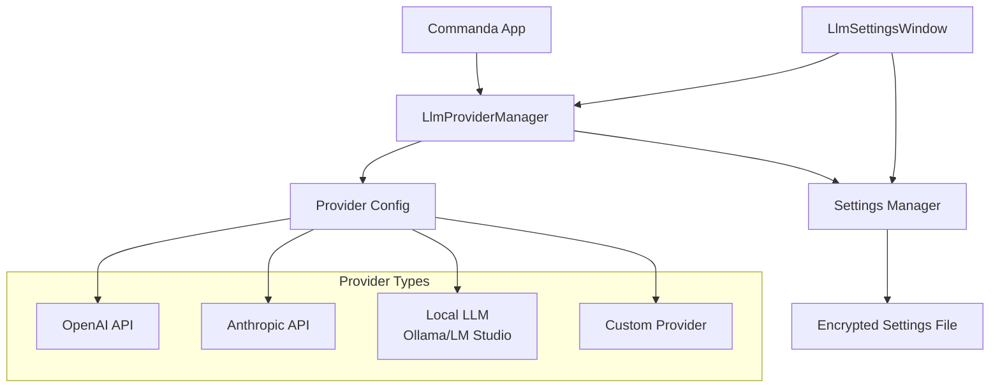

# ADR-014: 柔軟なLLMプロバイダ認証アーキテクチャ

## ステータス
承認済み

## 背景
ADR-010とADR-013で定義されたEntraID認証から、より柔軟なAPIキー方式へ変更します。これによりOpenAI、Anthropic、ローカルLLMなど様々なプロバイダに対応可能になります。

## 決定
以下の柔軟なプロバイダ認証方式を採用：

**プロバイダ構成:**
- APIキー + ベースURIによる設定
- OpenAI互換API形式のサポート
- プロバイダ自動検知と検証

**認証方式:**
- APIキー検証（設定時）
- 動的プロバイダ切り替え
- 設定の永続化と暗号化

## 影響

### 肯定的
- **柔軟性向上**: 多様なLLMプロバイダ対応
- **拡張性**: 新しいプロバイダの容易な追加
- **ローカル対応**: ローカルLLM利用可能
- **コスト最適化**: プロバイダ選択の自由度

### 否定的
- **セキュリティ依存**: APIキー管理の重要性増加
- **設定複雑性**: 複数プロバイダ設定の管理

### 中立的
- **エンタープライズ適合**: 様々な環境での利用可能

## 実装

### プロバイダ構成モデル
```csharp
public enum LlmProvider
{
    OpenAI,
    Anthropic,
    LocalOllama,
    LocalLmStudio,
    Custom
}

public class LlmProviderConfig
{
    public LlmProvider Provider { get; set; }
    public string Name { get; set; }
    public string ApiKey { get; set; }
    public string BaseUri { get; set; }
    public string ModelName { get; set; }
    public Dictionary<string, object> AdditionalSettings { get; set; }
    
    // OpenAI互換API判定
    public bool IsOpenAiCompatible => Provider switch
    {
        LlmProvider.OpenAI => true,
        LlmProvider.LocalOllama => true,
        LlmProvider.LocalLmStudio => true,
        LlmProvider.Custom => true,
        _ => false
    };
    
    // Anthropic判定
    public bool IsAnthropic => Provider == LlmProvider.Anthropic;
}

public class LlmSettings
{
    public List<LlmProviderConfig> Providers { get; set; } = new();
    public string DefaultProvider { get; set; }
    
    public LlmProviderConfig GetDefaultProvider()
    {
        return Providers.FirstOrDefault(p => p.Name == DefaultProvider) ?? Providers.FirstOrDefault();
    }
    
    public LlmProviderConfig GetProvider(string name)
    {
        return Providers.FirstOrDefault(p => p.Name == name);
    }
}
```

### プロバイダマネージャ
```csharp
public interface ILlmProviderManager
{
    Task<LlmProviderConfig> GetActiveProviderAsync();
    Task<bool> ValidateProviderAsync(LlmProviderConfig config);
    Task<IEnumerable<string>> GetAvailableModelsAsync(LlmProviderConfig config);
    Task SwitchProviderAsync(string providerName);
}

public class LlmProviderManager : ILlmProviderManager
{
    private readonly ISettingsManager _settingsManager;
    private readonly HttpClient _httpClient;
    private LlmProviderConfig _activeProvider;
    
    public LlmProviderManager(ISettingsManager settingsManager, HttpClient httpClient)
    {
        _settingsManager = settingsManager;
        _httpClient = httpClient;
    }
    
    public async Task<LlmProviderConfig> GetActiveProviderAsync()
    {
        if (_activeProvider == null)
        {
            var settings = await _settingsManager.LoadLlmSettingsAsync();
            _activeProvider = settings.GetDefaultProvider();
        }
        
        return _activeProvider;
    }
    
    public async Task<bool> ValidateProviderAsync(LlmProviderConfig config)
    {
        try
        {
            using var request = new HttpRequestMessage(HttpMethod.Post, 
                BuildValidationUrl(config));
            
            request.Headers.Add("Authorization", 
                config.IsAnthropic ? 
                    $"Bearer {config.ApiKey}" : 
                    $"Bearer {config.ApiKey}");
            
            if (config.IsOpenAiCompatible)
            {
                request.Content = new StringContent(
                    @"{""model"": """ + (config.ModelName ?? "gpt-3.5-turbo") + @""", ""messages"": [{""role"": ""user"", ""content"": ""Hello""}]}",
                    Encoding.UTF8, "application/json");
            }
            else // Anthropic
            {
                request.Content = new StringContent(
                    @"{""model"": """ + (config.ModelName ?? "claude-3-haiku-20240307") + @""", ""max_tokens"": 10, ""messages"": [{""role"": ""user"", ""content"": ""Hello""}]}",
                    Encoding.UTF8, "application/json");
            }
            
            using var response = await _httpClient.SendAsync(request);
            
            return response.IsSuccessStatusCode;
        }
        catch
        {
            return false;
        }
    }
    
    public async Task<IEnumerable<string>> GetAvailableModelsAsync(LlmProviderConfig config)
    {
        try
        {
            using var request = new HttpRequestMessage(HttpMethod.Get, 
                config.BaseUri.TrimEnd('/') + "/models");
            
            request.Headers.Add("Authorization", $"Bearer {config.ApiKey}");
            
            using var response = await _httpClient.SendAsync(request);
            
            if (response.IsSuccessStatusCode)
            {
                var content = await response.Content.ReadAsStringAsync();
                var modelsResponse = JsonSerializer.Deserialize<ModelsResponse>(content);
                
                return modelsResponse?.Data?.Select(m => m.Id) ?? 
                       new[] { config.ModelName ?? "default" };
            }
            
            // モデル取得失敗時は設定されたモデル名を使用
            return new[] { config.ModelName ?? "default" };
        }
        catch
        {
            return new[] { config.ModelName ?? "default" };
        }
    }
    
    public async Task SwitchProviderAsync(string providerName)
    {
        var settings = await _settingsManager.LoadLlmSettingsAsync();
        var provider = settings.GetProvider(providerName);
        
        if (provider != null)
        {
            _activeProvider = provider;
        }
    }
    
    private string BuildValidationUrl(LlmProviderConfig config)
    {
        if (config.IsOpenAiCompatible)
        {
            return config.BaseUri.TrimEnd('/') + "/chat/completions";
        }
        else // Anthropic
        {
            return config.BaseUri.TrimEnd('/') + "/messages";
        }
    }
}

public class ModelsResponse
{
    public List<ModelInfo> Data { get; set; }
}

public class ModelInfo
{
    public string Id { get; set; }
}
```

### 設定マネージャ拡張
```csharp
public interface ISettingsManager
{
    Task<LlmSettings> LoadLlmSettingsAsync();
    Task SaveLlmSettingsAsync(LlmSettings settings);
    Task<LlmProviderConfig> AddProviderAsync(LlmProviderConfig config);
    Task<bool> RemoveProviderAsync(string providerName);
    Task<bool> TestProviderAsync(LlmProviderConfig config);
}

public class SettingsManager : ISettingsManager
{
    private readonly string _settingsPath;
    
    public SettingsManager()
    {
        var appData = Environment.GetFolderPath(Environment.SpecialFolder.LocalApplicationData);
        _settingsPath = Path.Combine(appData, "Commanda", "llm_settings.json");
    }
    
    public async Task<LlmSettings> LoadLlmSettingsAsync()
    {
        if (!File.Exists(_settingsPath))
        {
            // デフォルト設定を作成
            var defaultSettings = CreateDefaultSettings();
            await SaveLlmSettingsAsync(defaultSettings);
            return defaultSettings;
        }
        
        var encryptedJson = await File.ReadAllTextAsync(_settingsPath);
        var json = await DecryptAsync(encryptedJson);
        
        return JsonSerializer.Deserialize<LlmSettings>(json) ?? CreateDefaultSettings();
    }
    
    public async Task SaveLlmSettingsAsync(LlmSettings settings)
    {
        var json = JsonSerializer.Serialize(settings, new JsonSerializerOptions 
        { 
            WriteIndented = true 
        });
        
        var encryptedJson = await EncryptAsync(json);
        
        Directory.CreateDirectory(Path.GetDirectoryName(_settingsPath)!);
        await File.WriteAllTextAsync(_settingsPath, encryptedJson);
    }
    
    public async Task<LlmProviderConfig> AddProviderAsync(LlmProviderConfig config)
    {
        var settings = await LoadLlmSettingsAsync();
        
        // 重複チェック
        if (settings.Providers.Any(p => p.Name == config.Name))
        {
            throw new InvalidOperationException($"Provider '{config.Name}' already exists.");
        }
        
        // APIキーを暗号化
        config.ApiKey = await EncryptAsync(config.ApiKey);
        
        settings.Providers.Add(config);
        await SaveLlmSettingsAsync(settings);
        
        return config;
    }
    
    public async Task<bool> RemoveProviderAsync(string providerName)
    {
        var settings = await LoadLlmSettingsAsync();
        var provider = settings.Providers.FirstOrDefault(p => p.Name == providerName);
        
        if (provider != null)
        {
            settings.Providers.Remove(provider);
            await SaveLlmSettingsAsync(settings);
            return true;
        }
        
        return false;
    }
    
    public async Task<bool> TestProviderAsync(LlmProviderConfig config)
    {
        // APIキーを復号化してテスト
        var testConfig = config with { ApiKey = await DecryptAsync(config.ApiKey) };
        var manager = new LlmProviderManager(this, new HttpClient());
        return await manager.ValidateProviderAsync(testConfig);
    }
    
    private LlmSettings CreateDefaultSettings()
    {
        return new LlmSettings
        {
            Providers = new List<LlmProviderConfig>(),
            DefaultProvider = null
        };
    }
    
    private async Task<string> EncryptAsync(string plainText)
    {
        var data = Encoding.UTF8.GetBytes(plainText);
        var encryptedData = ProtectedData.Protect(data, null, DataProtectionScope.CurrentUser);
        return Convert.ToBase64String(encryptedData);
    }
    
    private async Task<string> DecryptAsync(string encryptedText)
    {
        var encryptedData = Convert.FromBase64String(encryptedText);
        var decryptedData = ProtectedData.Unprotect(encryptedData, null, DataProtectionScope.CurrentUser);
        return Encoding.UTF8.GetString(decryptedData);
    }
}
```

### UI設定画面
```xaml
<!-- LlmSettingsWindow.xaml -->
<Window x:Class="Commanda.LlmSettingsWindow"
        xmlns="http://schemas.microsoft.com/winfx/2006/xaml/presentation"
        xmlns:x="http://schemas.microsoft.com/winfx/2006/xaml"
        xmlns:d="http://schemas.microsoft.com/expression/blend/2008"
        xmlns:mc="http://schemas.openxmlformats.org/markup-compatibility/2006"
        mc:Ignorable="d"
        Title="LLMプロバイダ設定" Height="600" Width="800"
        WindowStartupLocation="CenterOwner">
    
    <Grid Margin="20">
        <Grid.RowDefinitions>
            <RowDefinition Height="Auto"/>
            <RowDefinition Height="*"/>
            <RowDefinition Height="Auto"/>
        </Grid.RowDefinitions>
        
        <!-- ヘッダー -->
        <TextBlock Grid.Row="0" Text="LLMプロバイダ設定" 
                  FontSize="18" FontWeight="SemiBold" Margin="0,0,0,20"/>
        
        <!-- プロバイダリストと設定 -->
        <Grid Grid.Row="1">
            <Grid.ColumnDefinitions>
                <ColumnDefinition Width="250"/>
                <ColumnDefinition Width="*"/>
            </Grid.ColumnDefinitions>
            
            <!-- プロバイダリスト -->
            <Border Grid.Column="0" Background="{StaticResource SecondaryBackgroundBrush}" 
                   CornerRadius="4" Margin="0,0,10,0">
                <StackPanel>
                    <TextBlock Text="プロバイダ" FontWeight="SemiBold" Margin="10"/>
                    <ListBox x:Name="ProvidersListBox" 
                            ItemsSource="{Binding Providers}"
                            DisplayMemberPath="Name"
                            SelectedItem="{Binding SelectedProvider}"
                            Margin="10,0,10,10"/>
                    
                    <Button Content="追加" 
                           Command="{Binding AddProviderCommand}" 
                           Style="{StaticResource PrimaryButtonStyle}"
                           Margin="10,0,10,10"/>
                    
                    <Button Content="削除" 
                           Command="{Binding RemoveProviderCommand}" 
                           Style="{StaticResource SecondaryButtonStyle}"
                           Margin="10,0,10,10"/>
                </StackPanel>
            </Border>
            
            <!-- プロバイダ設定 -->
            <Border Grid.Column="1" Background="{StaticResource SecondaryBackgroundBrush}" 
                   CornerRadius="4">
                <ScrollViewer>
                    <StackPanel Margin="20">
                        <TextBlock Text="プロバイダ設定" FontWeight="SemiBold" Margin="0,0,0,20"/>
                        
                        <!-- プロバイダタイプ -->
                        <TextBlock Text="プロバイダタイプ" Margin="0,0,0,5"/>
                        <ComboBox ItemsSource="{Binding ProviderTypes}" 
                                 SelectedItem="{Binding SelectedProvider.Provider}"
                                 Margin="0,0,0,15"/>
                        
                        <!-- 名前 -->
                        <TextBlock Text="名前" Margin="0,0,0,5"/>
                        <TextBox Text="{Binding SelectedProvider.Name}" 
                                PlaceholderText="プロバイダの名前を入力"
                                Margin="0,0,0,15"/>
                        
                        <!-- APIキー -->
                        <TextBlock Text="APIキー" Margin="0,0,0,5"/>
                        <PasswordBox x:Name="ApiKeyBox" 
                                    Password="{Binding ApiKey}"
                                    Margin="0,0,0,15"/>
                        
                        <!-- ベースURI -->
                        <TextBlock Text="ベースURI" Margin="0,0,0,5"/>
                        <TextBox Text="{Binding SelectedProvider.BaseUri}" 
                                PlaceholderText="https://api.openai.com/v1"
                                Margin="0,0,0,15"/>
                        
                        <!-- モデル名 -->
                        <TextBlock Text="モデル名" Margin="0,0,0,5"/>
                        <TextBox Text="{Binding SelectedProvider.ModelName}" 
                                PlaceholderText="gpt-3.5-turbo"
                                Margin="0,0,0,15"/>
                        
                        <!-- テストボタン -->
                        <Button Content="テスト接続" 
                               Command="{Binding TestProviderCommand}" 
                               Style="{StaticResource PrimaryButtonStyle}"
                               HorizontalAlignment="Left"/>
                        
                        <!-- テスト結果 -->
                        <TextBlock Text="{Binding TestResult}" 
                                  Foreground="{Binding TestResultColor}"
                                  Margin="0,10,0,0"/>
                    </StackPanel>
                </ScrollViewer>
            </Border>
        </Grid>
        
        <!-- フッター -->
        <StackPanel Grid.Row="2" Orientation="Horizontal" HorizontalAlignment="Right" Margin="0,20,0,0">
            <Button Content="保存" 
                   Command="{Binding SaveCommand}" 
                   Style="{StaticResource PrimaryButtonStyle}"/>
            
            <Button Content="キャンセル" 
                   Command="{Binding CancelCommand}" 
                   Style="{StaticResource SecondaryButtonStyle}"
                   Margin="10,0,0,0"/>
        </StackPanel>
    </Grid>
</Window>
```

### プロバイダ自動検知
```csharp
public class ProviderDetector
{
    public static LlmProvider DetectProvider(string baseUri, string modelName = null)
    {
        var uri = baseUri.ToLowerInvariant();
        
        if (uri.Contains("openai.com"))
            return LlmProvider.OpenAI;
        
        if (uri.Contains("anthropic.com"))
            return LlmProvider.Anthropic;
        
        if (uri.Contains("localhost") || uri.Contains("127.0.0.1"))
        {
            // ポート番号で判定
            if (uri.Contains(":11434")) // Ollamaデフォルトポート
                return LlmProvider.LocalOllama;
            
            if (uri.Contains(":1234")) // LM Studioデフォルトポート
                return LlmProvider.LocalLmStudio;
        }
        
        return LlmProvider.Custom;
    }
    
    public static string GetDefaultBaseUri(LlmProvider provider)
    {
        return provider switch
        {
            LlmProvider.OpenAI => "https://api.openai.com/v1",
            LlmProvider.Anthropic => "https://api.anthropic.com",
            LlmProvider.LocalOllama => "http://localhost:11434/v1",
            LlmProvider.LocalLmStudio => "http://localhost:1234/v1",
            _ => ""
        };
    }
    
    public static string GetDefaultModel(LlmProvider provider)
    {
        return provider switch
        {
            LlmProvider.OpenAI => "gpt-3.5-turbo",
            LlmProvider.Anthropic => "claude-3-haiku-20240307",
            LlmProvider.LocalOllama => "llama2",
            LlmProvider.LocalLmStudio => "local-model",
            _ => ""
        };
    }
}
```

### アーキテクチャ図


## 監視
- プロバイダ接続の成功率
- API応答時間とエラー率
- プロバイダ切り替えの頻度
- 設定変更の追跡