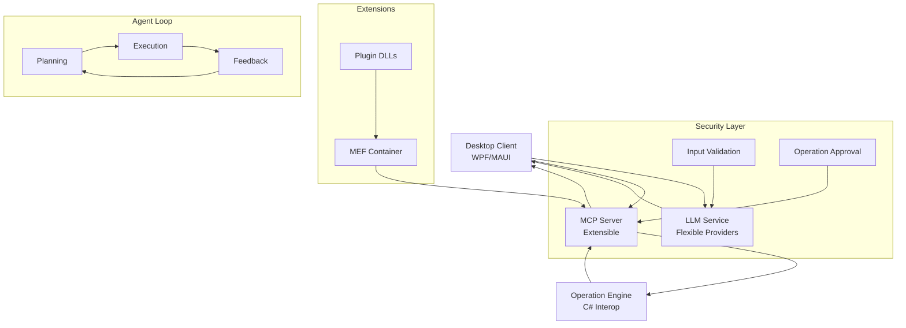
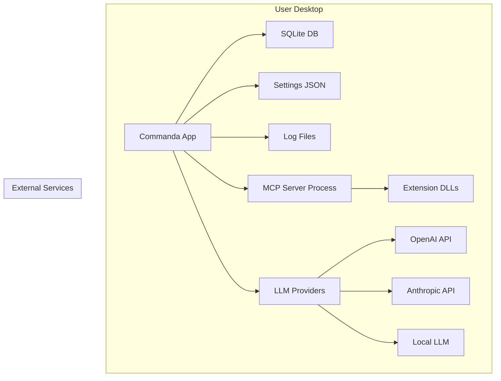
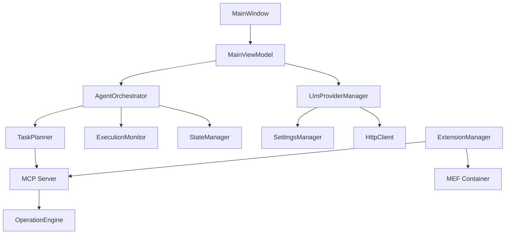

# Commanda 基本設計書

## 1. システム概要

### 1.1 プロジェクト概要
Commandaは、クラウドLLMとローカルMCPサーバーを組み合わせたデスクトップAIエージェントです。ユーザーの自然言語指示をクラウドLLMで解析し、JSON形式の安全な操作指示としてローカルMCPに渡すことで、ファイル操作やアプリ制御を安全かつ効率的に自動化します。

### 1.2 システム目標
- **ゼロショット実行**: LLM問い合わせからタスク実行までを自然言語で完結
- **安全性確保**: ローカル実行による機密情報の保護
- **拡張性**: プラグインアーキテクチャによる機能拡張
- **ユーザビリティ**: シンプルで直感的な操作性

### 1.3 主要機能
- 自然言語によるPC操作指示
- リアルタイムの実行状態表示
- 拡張機能によるカスタム操作
- 多様なLLMプロバイダ対応
- 実行履歴とログ管理

## 2. アーキテクチャ概要

### 2.1 全体アーキテクチャ

### 2.2 アーキテクチャパターン
- **MVVMパターン**: UIとロジックの分離
- **MEF (Managed Extensibility Framework)**: プラグイン拡張
- **ReActパターン**: 自律エージェント実行ループ
- **リポジトリパターン**: データアクセス抽象化

## 3. 主要コンポーネント

### 3.1 Desktop Client
- **技術**: WPF/MAUI
- **責任**: UI表示、ユーザー入力受付、コンポーネント間調整
- **主要機能**: チャットインターフェース、設定管理、実行状態表示

### 3.2 LLM Service
- **技術**: HttpClient + JSON RPC
- **責任**: 自然言語解析、実行計画生成
- **対応プロバイダ**: OpenAI, Anthropic, Local LLM (Ollama, LM Studio)

### 3.3 MCP Server
- **技術**: ASP.NET Core + ModelContextProtocol SDK
- **責任**: ツール管理、安全性検証、実行制御
- **拡張性**: MEFによる動的拡張

### 3.4 Operation Engine
- **技術**: C# Interop + Process API
- **責任**: 実際のPC操作実行
- **サポート操作**: ファイル操作、アプリ制御、Excel/Word自動化

### 3.5 Agent Orchestrator
- **技術**: ステートマシン + 非同期処理
- **責任**: 自律実行ループ管理
- **フロー**: Planning → Execution → Evaluation → Feedback

## 4. 技術スタック

### 4.1 開発言語
- **C#**: .NET 8.0以上
- **XAML**: UI定義

### 4.2 主要ライブラリ
- **ModelContextProtocol**: MCP実装
- **Microsoft.Extensions.Hosting**: ホスティング
- **System.Text.Json**: JSON処理
- **MaterialDesignThemes**: UIテーマ

### 4.3 データストレージ
- **SQLite**: ローカルDB (Entity Framework Core)
- **JSON**: 設定ファイル
- **テキストファイル**: ログ (ローテーション)

### 4.4 通信プロトコル
- **HTTPS/TLS 1.3**: 外部API通信
- **SSE (Server-Sent Events)**: リアルタイム応答
- **gRPC/HTTP2**: 内部通信 (将来拡張)

## 5. 非機能要件

### 5.1 パフォーマンス
- **応答時間**: UI操作 < 100ms, LLM応答 < 3秒
- **メモリ使用量**: 起動時 < 100MB, 実行時 < 200MB
- **CPU使用率**: アイドル時 < 5%, 実行時 < 20%

### 5.2 セキュリティ
- **データ暗号化**: APIキー・設定の暗号化保存
- **実行サンドボックス**: 拡張機能の分離実行
- **入力検証**: LLMプロンプトと操作パラメータの検証

### 5.3 可用性
- **オフライン対応**: ローカルLLM使用時のオフライン動作
- **障害回復**: 実行失敗時の自動リトライとフォールバック

### 5.4 保守性
- **拡張性**: MEFによるプラグインアーキテクチャ
- **テスト容易性**: ユニットテスト・統合テスト
- **ドキュメンテーション**: ADRベースのアーキテクチャ決定記録

### 5.5 ユーザビリティ
- **アクセシビリティ**: WCAG 2.1準拠
- **多言語対応**: 日本語・英語インターフェース
- **レスポンシブ**: 異なる画面サイズ対応

## 6. システム構成図

### 6.1 デプロイメント構成

### 6.2 コンポーネント関係図

## 7. リスクと対策

### 7.1 技術的リスク
- **LLM依存**: 外部APIの可用性リスク → 複数プロバイダ対応
- **拡張セキュリティ**: 悪意ある拡張リスク → サンドボックス実行
- **パフォーマンス**: LLM遅延リスク → ストリーミング応答

### 7.2 運用リスク
- **データ損失**: 設定・ログの消失リスク → 定期バックアップ
- **互換性**: OS/フレームワーク更新リスク → テスト自動化
- **サポート**: ユーザー問い合わせリスク → 詳細ドキュメント

## 8. 開発フェーズ

### 8.1 Phase 1: PoC (2週間)
- 基本UIとLLM統合
- シンプルなMCPサーバー
- 基本ファイル操作

### 8.2 Phase 2: MVP (4週間)
- エージェント実行ループ
- 拡張アーキテクチャ
- セキュリティ実装

### 8.3 Phase 3: フルリリース (8週間)
- UI/UX改善
- テストとドキュメント
- エコシステム構築

## 9. 品質保証

### 9.1 テスト戦略
- **ユニットテスト**: 各コンポーネントの機能テスト
- **統合テスト**: エージェント実行フローのテスト
- **E2Eテスト**: 実際のユーザーシナリオテスト
- **パフォーマンステスト**: 負荷テストとベンチマーク

### 9.2 コード品質
- **静的解析**: StyleCop, Roslynアナライザ
- **コードレビュー**: PRベースのレビュー
- **継続的インテグレーション**: GitHub Actions

## 10. 結論

Commandaは、LLMの力を活用しつつローカル実行による安全性を確保した革新的なPC操作自動化ツールです。拡張性とユーザビリティを両立した設計により、様々なユースケースに対応可能です。

この基本設計書は、詳細設計の基盤となるものであり、以降の開発で継続的に更新・改善されます。